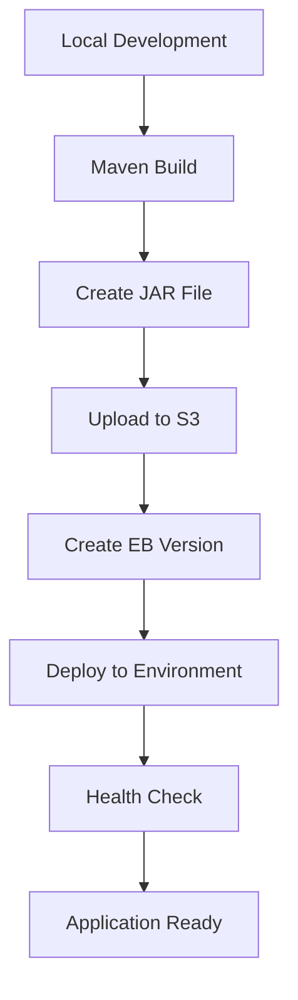

# 🚀 Email Integrator - Complete Deployment & Operations Guide

## 📋 Table of Contents
1. [Application Overview](#application-overview)
2. [Prerequisites](#prerequisites)
3. [Deployment Process](#deployment-process)
4. [Understanding What Gets Deployed](#understanding-what-gets-deployed)
5. [Monitoring & Logs](#monitoring--logs)
6. [Operations & Maintenance](#operations--maintenance)
7. [Troubleshooting](#troubleshooting)
8. [Cleanup & Resource Management](#cleanup--resource-management)

---

## 📖 Application Overview

The **Email Integrator** is a Spring Boot microservice that provides email functionality with user approval workflows. It's designed to send templated emails for various scenarios like user registration approvals, account notifications, and confirmation emails.

### 🏗️ Architecture
```
┌─────────────────┐    ┌─────────────────┐    ┌─────────────────┐
│   Client App    │───▶│  Email Service  │───▶│   Gmail SMTP    │
│                 │    │  (Spring Boot)  │    │                 │
└─────────────────┘    └─────────────────┘    └─────────────────┘
                              │
                              ▼
                       ┌─────────────────┐
                       │   AWS EB/EC2    │
                       │   (Deployment)  │
                       └─────────────────┘
```

### 🎯 Key Features
- **Email Templates**: Approval, notification, and confirmation emails
- **JWT Integration**: Secure token-based approval links
- **Gmail SMTP**: Email delivery via Gmail
- **Health Monitoring**: Built-in health check endpoints
- **Error Handling**: Comprehensive logging and error management

---

## 🔧 Prerequisites

### Required Software
```bash
# Java Development Kit 17
java -version  # Should show Java 17

# Maven (for building)
mvn -version   # Should show Maven 3.6+

# AWS CLI (for deployment)
aws --version  # Should show AWS CLI 2.0+

# Docker (optional, for containerization)
docker --version
```

### Required Accounts & Access
1. **AWS Account** with appropriate permissions
2. **Gmail Account** with App Password enabled
3. **Environment Variables** configured

### Environment Setup
Create these environment variables before deployment:

```bash
# Required for email functionality
export MAIL_PASSWORD="your-gmail-app-password"
export JWT_SECRET="your-256-bit-secret-key"

# Optional AWS configuration
export AWS_REGION="us-east-1"
export APP_NAME="email-integrator"
```

---

## 🚀 Deployment Process

### Step 1: Pre-Deployment Checklist
```bash
# 1. Verify Java version
java -version

# 2. Test Maven build
mvn clean compile

# 3. Run tests locally
mvn test

# 4. Check AWS credentials
aws sts get-caller-identity
```

### Step 2: Build the Application
```bash
# Clean and build the JAR file
mvn clean install

# Verify the JAR was created
ls -la target/*.jar
```

### Step 2.5: Verify your environment variables are set:

MAIL_PASSWORD (Gmail app password)

JWT_SECRET (32+ character secret)


### Step 3: Deploy to AWS Elastic Beanstalk
```bash
# Make the deployment script executable
chmod +x eb-deploy.sh

# Run the deployment script
./eb-deploy.sh
```

### Step 4: Verify Deployment
```bash
# Check application health
curl http://your-app-url.elasticbeanstalk.com/actuator/health

# Expected response:
# {"status":"UP"}
```

---

## 🔍 Understanding What Gets Deployed

### Deployment Components

#### 1. **Elastic Beanstalk Application**
- **Name**: `springboot-app` (or custom name)
- **Platform**: Java 17 on Amazon Linux
- **Instance Type**: t3.micro (default)

#### 2. **EC2 Instance**
- **Auto-scaling**: Configured for 1-10 instances
- **Load Balancer**: Application Load Balancer (ALB)
- **Security Groups**: HTTP/HTTPS access

#### 3. **S3 Bucket**
- **Purpose**: Stores application versions
- **Naming**: `elasticbeanstalk-{region}-{account-id}`

#### 4. **CloudWatch Resources**
- **Log Groups**: Application and system logs
- **Metrics**: CPU, memory, request count
- **Alarms**: Health check failures

### Deployment Flow Diagram


### File Structure After Deployment
```
AWS Elastic Beanstalk Environment:
├── EC2 Instance
│   ├── /var/log/eb-engine.log          # EB deployment logs
│   ├── /var/log/eb-hooks.log           # Hook execution logs
│   ├── /var/log/nginx/                 # Web server logs
│   └── /opt/elasticbeanstalk/          # EB configuration
├── Application JAR
│   └── /var/app/current/application.jar
└── Environment Variables
    ├── MAIL_PASSWORD
    ├── JWT_SECRET
    └── SERVER_PORT=5000
```

---

## 📊 Monitoring & Logs

### Health Monitoring

#### Application Health Endpoint
```bash
# Check application status
curl http://your-app-url/actuator/health

# Detailed health information
curl http://your-app-url/actuator/health/details
```

#### AWS Console Monitoring
1. **Elastic Beanstalk Console**
   - Navigate to: AWS Console → Elastic Beanstalk → Your Application
   - Monitor: Health, Events, Logs

2. **CloudWatch Dashboard**
   - Navigate to: AWS Console → CloudWatch → Dashboards
   - View: CPU, Memory, Request metrics

### Log Management

#### Viewing Logs via AWS Console
1. **Access EB Console**: AWS Console → Elastic Beanstalk → Your App
2. **Navigate to Logs**: Left sidebar → Logs
3. **Request Logs**: 
   - **Last 100 Lines**: Quick view of recent logs
   - **Full Logs**: Complete log bundle (ZIP file)

#### Viewing Logs via AWS CLI
```bash
# Get recent application logs
aws elasticbeanstalk retrieve-environment-info \
    --environment-name your-env-name \
    --info-type tail

# Download full log bundle
aws elasticbeanstalk request-environment-info \
    --environment-name your-env-name \
    --info-type bundle

# Retrieve the bundle URL
aws elasticbeanstalk retrieve-environment-info \
    --environment-name your-env-name \
    --info-type bundle
```

#### Log Types and Locations
| Log Type | Location | Purpose |
|----------|----------|---------|
| Application Logs | `/var/log/web.stdout.log` | Spring Boot application output |
| Error Logs | `/var/log/web.stderr.log` | Application errors |
| EB Engine | `/var/log/eb-engine.log` | Deployment process |
| Nginx Access | `/var/log/nginx/access.log` | HTTP requests |
| Nginx Error | `/var/log/nginx/error.log` | Web server errors |

#### Reading Logs Effectively
```bash
# Filter for errors in application logs
grep -i "error\|exception\|failed" /var/log/web.stdout.log

# Check recent deployment logs
tail -f /var/log/eb-engine.log

# Monitor real-time application logs
tail -f /var/log/web.stdout.log
```

### CloudWatch Logs Integration

#### Setting Up Log Streaming
```bash
# Enable CloudWatch logs (via EB configuration)
aws elasticbeanstalk update-environment \
    --environment-name your-env-name \
    --option-settings \
    Namespace=aws:elasticbeanstalk:cloudwatch:logs,OptionName=StreamLogs,Value=true
```

#### Querying CloudWatch Logs
```bash
# List log groups
aws logs describe-log-groups --log-group-name-prefix "/aws/elasticbeanstalk"

# Get log events
aws logs get-log-events \
    --log-group-name "/aws/elasticbeanstalk/your-app/var/log/web.stdout.log" \
    --log-stream-name "your-stream-name"
```

---

## 🔧 Operations & Maintenance

### Application Updates

#### Deploying New Versions
```bash
# 1. Build new version
mvn clean install

# 2. Deploy with version label
./eb-deploy.sh -v "v2.0.1"

# 3. Monitor deployment
aws elasticbeanstalk describe-events \
    --environment-name your-env-name \
    --max-items 10
```

#### Rolling Back Deployments
```bash
# List available versions
aws elasticbeanstalk describe-application-versions \
    --application-name your-app-name

# Deploy previous version
aws elasticbeanstalk update-environment \
    --environment-name your-env-name \
    --version-label "previous-version-label"
```

### Environment Management

#### Scaling the Application
```bash
# Update instance count
aws elasticbeanstalk update-environment \
    --environment-name your-env-name \
    --option-settings \
    Namespace=aws:autoscaling:asg,OptionName=MinSize,Value=2 \
    Namespace=aws:autoscaling:asg,OptionName=MaxSize,Value=5
```

#### Environment Variables Management
```bash
# Update environment variables
aws elasticbeanstalk update-environment \
    --environment-name your-env-name \
    --option-settings \
    Namespace=aws:elasticbeanstalk:application:environment,OptionName=MAIL_PASSWORD,Value=new-password
```

### Performance Monitoring

#### Key Metrics to Watch
1. **Application Health**: Response time, error rate
2. **System Resources**: CPU, memory usage
3. **Request Volume**: Requests per minute
4. **Email Delivery**: Success/failure rates

#### Setting Up Alarms
```bash
# Create CloudWatch alarm for high CPU
aws cloudwatch put-metric-alarm \
    --alarm-name "HighCPU-EmailIntegrator" \
    --alarm-description "Alarm when CPU exceeds 80%" \
    --metric-name CPUUtilization \
    --namespace AWS/EC2 \
    --statistic Average \
    --period 300 \
    --threshold 80 \
    --comparison-operator GreaterThanThreshold
```

---

## 🚨 Troubleshooting

### Common Issues and Solutions

#### 1. **Application Won't Start**
```bash
# Check deployment logs
aws elasticbeanstalk describe-events --environment-name your-env-name

# Common causes:
# - Missing environment variables
# - Java version mismatch
# - Port binding issues
```

#### 2. **Health Check Failures**
```bash
# Verify health endpoint
curl http://your-app-url/actuator/health

# Check nginx configuration
sudo cat /etc/nginx/conf.d/elasticbeanstalk/healthd.conf
```

#### 3. **Email Sending Failures**
```bash
# Check application logs for email errors
grep -i "mail\|smtp\|email" /var/log/web.stdout.log

# Verify Gmail app password
# Check firewall/security group settings
```

#### 4. **High Memory Usage**
```bash
# Check JVM heap settings
ps aux | grep java

# Update JVM options via EB configuration
aws elasticbeanstalk update-environment \
    --environment-name your-env-name \
    --option-settings \
    Namespace=aws:elasticbeanstalk:container:java:jvm,OptionName=Xmx,Value=512m
```

### Debug Mode Activation
```bash
# Enable debug logging
aws elasticbeanstalk update-environment \
    --environment-name your-env-name \
    --option-settings \
    Namespace=aws:elasticbeanstalk:application:environment,OptionName=LOGGING_LEVEL_ROOT,Value=DEBUG
```

---

## 🧹 Cleanup & Resource Management

### Temporary Environment Cleanup
```bash
# Terminate environment (keeps application)
aws elasticbeanstalk terminate-environment \
    --environment-name your-env-name

# Delete application completely
aws elasticbeanstalk delete-application \
    --application-name your-app-name \
    --terminate-env-by-force
```

### Complete Resource Cleanup Script
Create a cleanup script for complete resource removal:

```bash
#!/bin/bash
# cleanup-resources.sh

APP_NAME="your-app-name"
ENV_NAME="your-env-name"
REGION="us-east-1"

echo "🧹 Starting cleanup process..."

# 1. Terminate environment
echo "Terminating environment: $ENV_NAME"
aws elasticbeanstalk terminate-environment \
    --environment-name $ENV_NAME \
    --region $REGION

# 2. Wait for termination
echo "Waiting for environment termination..."
aws elasticbeanstalk wait environment-terminated \
    --environment-names $ENV_NAME \
    --region $REGION

# 3. Delete application
echo "Deleting application: $APP_NAME"
aws elasticbeanstalk delete-application \
    --application-name $APP_NAME \
    --region $REGION

# 4. Clean up S3 versions (optional)
echo "Cleaning up S3 application versions..."
S3_BUCKET=$(aws elasticbeanstalk describe-application-versions \
    --application-name $APP_NAME \
    --query 'ApplicationVersions[0].SourceBundle.S3Bucket' \
    --output text 2>/dev/null)

if [ "$S3_BUCKET" != "None" ] && [ "$S3_BUCKET" != "" ]; then
    aws s3 rm s3://$S3_BUCKET --recursive --include "*$APP_NAME*"
fi

echo "✅ Cleanup completed!"
```

### Cost Management
```bash
# Check current costs
aws ce get-cost-and-usage \
    --time-period Start=2024-01-01,End=2024-01-31 \
    --granularity MONTHLY \
    --metrics BlendedCost \
    --group-by Type=DIMENSION,Key=SERVICE

# Set up billing alerts
aws cloudwatch put-metric-alarm \
    --alarm-name "BillingAlarm" \
    --alarm-description "Billing alarm" \
    --metric-name EstimatedCharges \
    --namespace AWS/Billing \
    --statistic Maximum \
    --period 86400 \
    --threshold 50 \
    --comparison-operator GreaterThanThreshold
```

---

## 📚 Additional Resources

### Documentation Links
- [Spring Boot Actuator](https://docs.spring.io/spring-boot/docs/current/reference/html/actuator.html)
- [AWS Elastic Beanstalk Developer Guide](https://docs.aws.amazon.com/elasticbeanstalk/latest/dg/)
- [CloudWatch Logs User Guide](https://docs.aws.amazon.com/AmazonCloudWatch/latest/logs/)

### Useful Commands Reference
```bash
# Quick health check
curl -s http://your-app-url/actuator/health | jq .

# Get environment status
aws elasticbeanstalk describe-environments \
    --environment-names your-env-name \
    --query 'Environments[0].Status'

# Stream logs in real-time
aws logs tail /aws/elasticbeanstalk/your-app/var/log/web.stdout.log --follow
```

### Emergency Contacts & Escalation
- **AWS Support**: [AWS Support Center](https://console.aws.amazon.com/support/)
- **Application Owner**: [Your team contact]
- **On-call Engineer**: [Your on-call system]

---

## 🎯 Summary for Junior Engineers

### Daily Operations Checklist
- [ ] Check application health endpoint
- [ ] Review CloudWatch metrics
- [ ] Monitor error logs for exceptions
- [ ] Verify email delivery success rates

### Weekly Maintenance Tasks
- [ ] Review and rotate logs
- [ ] Check for security updates
- [ ] Monitor AWS costs
- [ ] Update documentation if needed

### Monthly Reviews
- [ ] Analyze performance trends
- [ ] Review and optimize resource allocation
- [ ] Update dependencies and security patches
- [ ] Conduct disaster recovery testing

**Remember**: Always test changes in a staging environment before applying to production!

---

*This guide is designed to help junior engineers understand and manage the Email Integrator service effectively. Keep this document updated as the application evolves.*
