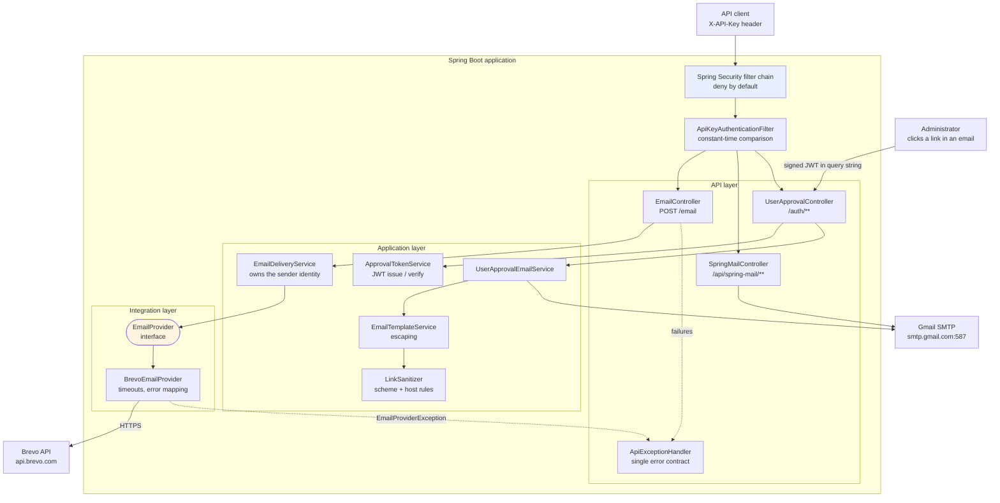

# Email Integrator

[](https://github.com/HoseaCodes/Email-Integrator/actions/workflows/build.yml)

A Spring Boot service that sends transactional email through an external provider and through
Gmail SMTP, built to explore the parts of integration work that are easy to skip: what happens
when the provider is slow, when it returns 429, when it accepts your request and then the
connection drops.

**Status: portfolio project.** Not production-ready, and the [Known Limitations](#known-limitations)
section says exactly why. Every claim below is backed by code in this repository — if something
is not implemented, it is listed as not implemented.

---

## Why this repository might be interesting

Most email-integration examples stop at "call the provider's SDK from a `@RestController`". The
questions this one tries to answer instead:

- **Sending email is not idempotent.** So what is a retry actually worth? This service does not
  retry, and [ADR 0002](docs/adr/0002-no-automatic-retries-on-email-send.md) explains why, plus
  what it would take to make retries safe.
- **A retry can be hiding in a library default.** Apache HttpClient 5 retries automatically,
  honouring `Retry-After` on 429 and 503. A test asserting "one send, one HTTP request" hung for
  ten minutes and exposed it. The client now disables retries explicitly, and a test keeps it
  that way.
- **Which failures could have already sent the email?** A refused connection could not have. A
  read timeout could have. That distinction is modelled as
  [`EmailProviderException.Reason.isSideEffectPossible()`](src/main/java/com/hoseacodes/emailintegrator/email/EmailProviderException.java)
  and surfaced to API callers as `deliveryUncertain`.
- **A provider auth failure is not the caller's fault.** It maps to 502, never 401.

The [engineering audit](docs/ENGINEERING_AUDIT.md) is also kept in the repository, including the
findings that were true of my own earlier code — a hardcoded credential, an API key printed to
stdout, and an unauthenticated endpoint that would mail arbitrary content to arbitrary
recipients.

---

## What it demonstrates

Implemented and covered by tests:

| Area | What is actually here |
|---|---|
| **Java / Spring Boot** | Java 17, Spring Boot 3.2.5, constructor injection, `@ConfigurationProperties` records with startup validation |
| **Integration architecture** | `EmailProvider` interface as an error-translation boundary; provider wire types confined to their own package |
| **Resilience** | Explicit connect/read timeouts; automatic retries deliberately disabled; failures classified by whether a side effect may have occurred |
| **Security** | Spring Security, deny-by-default filter chain, per-client API keys with constant-time comparison |
| **Input validation** | Bean Validation on typed request DTOs, with field-level error reporting |
| **Output encoding** | Context-aware escaping for email templates; scheme and host allowlists for caller-supplied links |
| **JWT** | Signed, expiring approval links with issuer and token-type validation, and a signing key that must be configured or the app refuses to start |
| **API design** | One error contract across every endpoint, correlation ids, no stack traces or provider detail in responses |
| **Testing** | 161 tests, including provider failure simulation against a real HTTP server (WireMock) |
| **Observability** | Actuator health/info, structured SLF4J logging that never records keys, tokens, or message bodies |
| **Docker / AWS** | Dockerfile and a scripted Elastic Beanstalk deployment that provisions secrets as environment properties |
| **CI** | GitHub Actions runs the full suite on every pull request and push to `master`; Dependabot raises grouped upgrade PRs |
| **Documentation** | Audit, ADRs, and this README kept consistent with the code |

Not implemented — see [Known Limitations](#known-limitations): TLS, idempotency, rate limiting,
application metrics, dependency vulnerability scanning.

---

## Architecture



**Why the `EmailProvider` interface exists with one implementation.** Not in anticipation of more
providers — that is the premature-abstraction trap. It exists so the application layer never
imports `sendinblue.ApiException` or knows what an HTTP status code is. It is the boundary where
provider failures become application failures.

---

## Request flow

`POST /email`, end to end:

1. **Security filter chain** — deny by default. The `X-API-Key` header is compared against
   configured client keys with `MessageDigest.isEqual`; a missing or wrong key returns 401 in the
   standard error shape, and the loop does not short-circuit on a match so timing does not leak
   key position.
2. **Controller** — `@Valid` runs Bean Validation on the typed DTO. Failures return 400 with
   per-field errors and never reach the provider. The DTO has no `from` field, so a caller cannot
   choose the sending identity.
3. **`EmailDeliveryService`** — applies the configured sender, honours the `app.email.enabled`
   kill switch, logs recipient *counts* rather than addresses.
4. **`BrevoEmailProvider`** — maps the command to Brevo's wire format and issues one POST with a
   3s connect and 10s read timeout. Automatic retries are disabled.
5. **Response mapping** — a message id becomes `202 Accepted`. The provider queued the message; it
   is not yet in anyone's mailbox, which is what 202 means.
6. **Failure mapping** — the provider's status becomes an `EmailProviderException` with a reason
   and a side-effect flag, which `ApiExceptionHandler` turns into 429 / 502 / 503 / 504 with a
   correlation id.

---

## Reliability

| Provider outcome | HTTP response | Could it have sent? |
|---|---|---|
| 400 rejected | 502 | No |
| 401 / 403 (our key) | 502 | No |
| 429 rate limited | 429 + `Retry-After` | No |
| 5xx | 502 | **Yes** — `deliveryUncertain: true` |
| Read timeout | 504 | **Yes** — `deliveryUncertain: true` |
| Connection refused / DNS | 503 | No |

A Brevo 400 maps to 502 rather than 400 deliberately: the caller's request already passed our
validation, which is the contract we published. If the provider still rejects it, the fault is in
our mapping or configuration, and telling the caller "bad request" sends them hunting for a
problem they cannot see.

**No retries.** Sending is not idempotent, and there is no idempotency key, so a retry on any
side-effect-possible failure risks a duplicate message. Full reasoning, including why a retry
storm makes a struggling provider worse, is in
[ADR 0002](docs/adr/0002-no-automatic-retries-on-email-send.md).

**No idempotency mechanism.** Documented as a known gap, not solved.

---

## Security

- **API keys**, per client, minimum 32 characters, no default. The application refuses to start
  without one rather than coming up open. Chosen over JWT bearer tokens because there is no user
  store and no identity provider — a bearer flow would mean the service minting tokens for
  itself. See [`ApiKeyProperties`](src/main/java/com/hoseacodes/emailintegrator/security/ApiKeyProperties.java).
- **Approval links are a different mechanism on purpose.** A signed, expiring JWT authorises one
  action for a human clicking a link in a mail client that cannot send headers. Issuer and token
  type are validated; the signing key has no default and must be at least 256 bits.
- **Template output is escaped by context.** Text is HTML-escaped; links are validated for scheme
  (`http`/`https` only) and optionally host before being escaped — because escaping alone leaves
  `javascript:alert(1)` a perfectly valid `href`.
- **Secrets** come from environment variables only. Nothing is committed;
  [`.env.example`](.env.example) documents every value. API keys, JWTs, and provider credentials
  are never logged.
- **Error responses** carry a correlation id, never a stack trace, provider response body, SMTP
  hostname, or account detail.

Full findings and remaining gaps: [docs/ENGINEERING_AUDIT.md](docs/ENGINEERING_AUDIT.md).

---

## Testing

161 tests. The emphasis is on failure paths, because the happy path is exercised by hand
constantly and the 429-at-3am path is exercised exactly once, in production, unless it is tested.

| Layer | What it proves |
|---|---|
| **Provider integration** (WireMock) | 400/401/403/429/500/502/503, read timeout, connection refused, truncated body, missing message id — each asserted for classification *and* whether a retry would be safe |
| **HTTP contract** (MockMvc) | Status codes, validation errors, the error contract, and that no response leaks a stack trace |
| **Security** (full context) | Every protected endpoint returns 401 without a key; wrong keys and key prefixes are rejected; public endpoints stay public |
| **JWT** | Tampered payloads, foreign signing keys, expiry, wrong issuer, wrong token type, the `alg: none` attack, malformed input |
| **Templating** | Script injection, attribute breakout, nested placeholders, dangerous URL schemes, host allowlist bypass attempts |
| **Domain** | Command invariants and defensive copying |

WireMock is used rather than a mocked HTTP client because the behaviour worth proving — how a
read timeout differs from a refused connection — needs a real socket. **No test contacts a live
provider or sends real email.**

The security tests were verified non-vacuous by mutation: changing `anyRequest().authenticated()`
to `permitAll()` fails 9 of 18 assertions.

```bash
./mvnw clean verify
```

---

## Observability

- `GET /actuator/health` — public, aggregate status only; component detail is not exposed.
- `GET /actuator/info` — requires a key.
- Structured SLF4J logging. Integration calls log operation, outcome, duration, and recipient
  *counts*. Failures log the classification and whether a side effect was possible.
- Every error response carries an `errorId` that also appears in the server log, so a caller can
  quote it and the matching line can be found without exposing detail to them.
- **Never logged:** API keys, JWTs, provider credentials, message bodies, recipient addresses.

Not implemented: application metrics, request-scoped correlation IDs on successful requests,
distributed tracing.

---

## Local development

**Prerequisites:** JDK 17, Maven (wrapper included), and optionally Docker.

```bash
git clone https://github.com/HoseaCodes/Email-Integrator.git
cd Email-Integrator

cp .env.example .env
# Fill in the four required values. Generate secrets with: openssl rand -base64 32
```

Spring Boot does **not** read `.env` on its own — there is no dotenv dependency — so export it:

```bash
set -a && . ./.env && set +a
./mvnw spring-boot:run
```

The application deliberately **fails to start** if `API_KEY_DEFAULT`, `BREVO_API_KEY`,
`JWT_SECRET`, or `MAIL_PASSWORD` is missing, or if a key is too short. The error names the
property and how to fix it.

### Developing without sending real email

```bash
APP_EMAIL_ENABLED=false ./mvnw spring-boot:run
```

Requests still run through authentication, validation, mapping, and error handling; sending
returns `503 EMAIL_SENDING_DISABLED`. To exercise the full provider path instead, point
`BREVO_BASE_URL` at a local stub.

### Try it

```bash
curl -s http://localhost:8082/actuator/health

curl -s -X POST http://localhost:8082/email \
  -H "Content-Type: application/json" \
  -H "X-API-Key: $API_KEY_DEFAULT" \
  -d '{
        "to": [{"email": "someone@example.com", "name": "Someone"}],
        "subject": "Hello",
        "htmlContent": "<p>Hello from Email Integrator</p>"
      }'
```

Omit the header to see the 401 contract; send `{}` with the header to see field-level validation
errors.

### Docker

```bash
./mvnw clean package
docker build -t hoseacodes-emailintegrator .
docker run --env-file .env -p 8082:8082 hoseacodes-emailintegrator
```

### Tests

```bash
./mvnw clean verify          # all 161
./mvnw test -Dtest=BrevoEmailProviderTest   # provider failure modes
```

---

## API documentation

With the application running:

- Swagger UI — <http://localhost:8082/swagger-ui.html>
- OpenAPI JSON — <http://localhost:8082/v3/api-docs>

Both are reachable without a key; they describe the contract, not data. The `X-API-Key` scheme is
declared, so Swagger UI's **Authorize** button works.

### Endpoints

| Method | Path | Auth | Notes |
|---|---|---|---|
| `POST` | `/email` | API key | Send via Brevo. Typed, validated, returns 202 |
| `POST` | `/auth/send-email` | API key | Templated Gmail send |
| `POST` | `/auth/manual-approve` · `/auth/manual-deny` | API key | Administrative |
| `POST` | `/api/spring-mail/send` | API key | Direct Gmail SMTP |
| `GET` | `/auth/approve` · `/auth/deny` | Signed JWT | Clicked from an email |
| `GET` | `/actuator/health` | none | Platform probe |
| `GET` | `/actuator/info` | API key | |

---

## AWS deployment

Single-instance Elastic Beanstalk on `t3.micro`, deployed by
[`eb-deploy.sh`](eb-deploy.sh), which validates required secrets before uploading anything and
applies them as environment properties before the new version rolls out.

**There is no TLS.** A single-instance environment has no load balancer and therefore no
certificate termination point. Do not put real traffic through it. The evolution path — and why
CloudFront rather than an ALB — is in [docs/AWS_ARCHITECTURE.md](docs/AWS_ARCHITECTURE.md).

---

## Engineering decisions

1. **[Dropped the vendor SDK for a hand-written HTTP client](docs/adr/0001-brevo-http-client-over-vendor-sdk.md)** —
   the SDK authenticated through global static state, exposed no timeout configuration, and pulled
   Maven 2.0.6 build tooling onto the runtime classpath. Brevo's send is one POST.
2. **[No automatic retries](docs/adr/0002-no-automatic-retries-on-email-send.md)** — and disabling
   the HTTP client's hidden ones, after a test hang revealed them.
3. **One interface, one implementation** — the boundary earns its place by translating errors, not
   by anticipating providers that do not exist.
4. **Fail fast on configuration** — no secret has a default. A service that refuses to start beats
   one that starts insecurely.
5. **The sender is not a request field** — `EmailDraft` has no `sender`, so caller-controlled
   spoofing cannot be expressed, rather than being rejected by a check someone might remove.

---

## Known limitations

Honest list. These are why this is not described as production-ready.

- **No TLS in the deployment.** Single-instance Elastic Beanstalk cannot terminate HTTPS.
- **No dependency vulnerability scanning.** Dependabot raises upgrade PRs, but nothing in CI
  fails a build on a known CVE. A green build means it compiles and the tests pass — nothing more.
- **The build requires JDK 17–22.** Byte Buddy, pulled in by Mockito via Spring Boot 3.2.5, does
  not support newer JDKs, so the test suite fails on JDK 23+. CI pins 17. This is a symptom of the
  Spring Boot version being past its support window, not a deliberate constraint.
- **No idempotency.** A client retry or a duplicate submission sends a second email. The
  `deliveryUncertain` flag tells a caller when this risk applies, but nothing prevents it.
- **No rate limiting.** An authenticated client can send until the provider's quota is exhausted.
  Do not expose this to untrusted clients.
- **`GET /auth/approve` and `/auth/deny` change state.** A mail client's link prefetcher can
  trigger an approval. Fixing this needs single-use tokens, which needs server-side token state.
- **Spring Boot 3.2.5 is past its OSS support window**, and no dependency scanning runs.
- **API keys are compared against plaintext configuration values**, not hashes.
- **The Dockerfile is not hardened** — runs as root, uses a JDK rather than a JRE base, no
  multi-stage build, and requires a prior host-side `package`.
- **Templating is hand-rolled**, not Thymeleaf. Escaping is applied deliberately at each
  substitution rather than by default from the engine.

## Documentation

- [Engineering audit](docs/ENGINEERING_AUDIT.md) — findings, severities, and current state
- [ADR 0001 — HTTP client over vendor SDK](docs/adr/0001-brevo-http-client-over-vendor-sdk.md)
- [ADR 0002 — No automatic retries](docs/adr/0002-no-automatic-retries-on-email-send.md)
- [AWS architecture](docs/AWS_ARCHITECTURE.md) — what is deployed and how it could evolve

---

## AI-assisted development

Parts of this codebase were written with AI assistance. Every change was reviewed, and the tests
were treated as the check on generated code rather than as decoration — the HttpClient retry
defect and two of my own incorrect test assertions were both found by running things, not by
reading them. Architectural decisions and their trade-offs are recorded in the ADRs so they can
be defended rather than merely pointed at.
