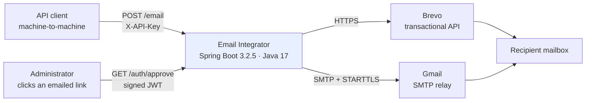
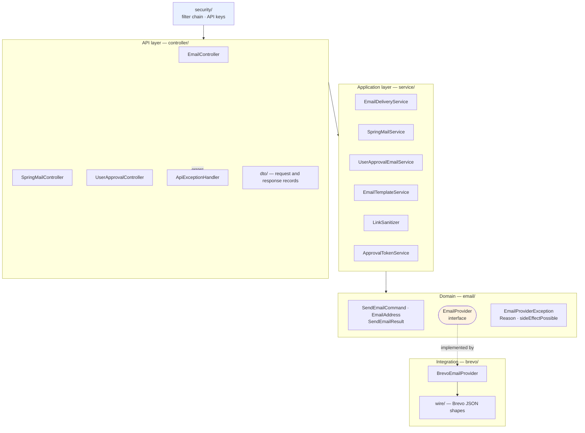
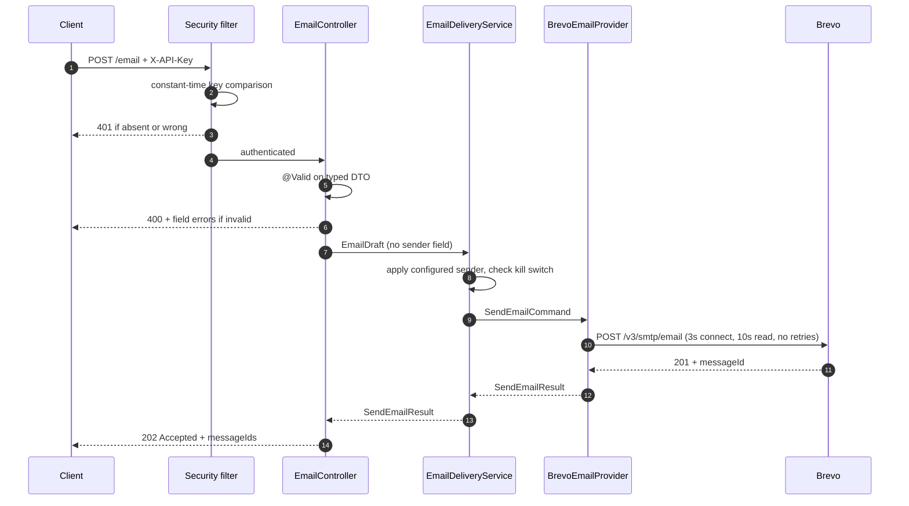

# Architecture

How the service is put together, and why the boundaries fall where they do.

---

## System context



The service owns no persistent state. There is no database, no cache, and no queue — every request
is handled synchronously and the only durable effect is at the provider. That single fact explains
most of what follows: with no state of our own, there is nowhere to record that a send already
happened, which is why [idempotency](RELIABILITY.md#idempotency) is a documented gap rather than a
feature.

---

## Layers



| Layer | Responsibility | Must not |
|---|---|---|
| **security/** | Who is calling | — |
| **controller/** | Validate the wire contract, translate to domain types | Contain business rules, know about providers, catch exceptions |
| **service/** | Application decisions: sending identity, kill switch, orchestration | Import provider types or reference HTTP status codes |
| **email/** | The vocabulary both sides share | Depend on anything above or below it |
| **brevo/** | Wire format, auth, timeouts, status interpretation | Leak its types upward |

The rules are enforced by review and documented in
[AGENTS.md](https://github.com/HoseaCodes/Email-Integrator/blob/master/AGENTS.md), not by a module
system. On a codebase this size that is a reasonable trade; at a larger size it would be worth
making them structural.

---

## The integration boundary

`EmailProvider` has exactly one implementation, and that is deliberate.

It does **not** exist in anticipation of a second provider. It exists because the application layer
must never import a vendor type. It is the point where a vendor's failures become the
application's failures:

```
BrevoEmailProvider          →  EmailProviderException(Reason, sideEffectPossible)
  HTTP 429                  →    RATE_LIMITED       (not sent)
  HTTP 5xx                  →    PROVIDER_UNAVAILABLE (may have sent)
  read timeout              →    TIMEOUT             (may have sent)
  connection refused        →    CONNECT_FAILED      (definitely not sent)
```

!!! note "Useful abstraction versus premature abstraction"
    **Useful:** hides something that would otherwise couple you to a detail you do not control —
    here, the vendor's exception types and wire format.

    **Premature:** indirection for a requirement that does not exist — a provider registry, a
    strategy selector, a factory, or a second fake implementation.

    This project has the first and none of the second. Adding a real second provider means writing
    one class and choosing between beans.

The failure this prevents is not hypothetical. A previous version had
`EMSBatchResponse extends EmailResponse` and exposed Brevo's request shape through `EmailInput` — so
the vendor's JSON *was* this service's published API contract, and a provider or API-version change
would have broken every caller.

---

## Request flow

`POST /email`, end to end:



**202, not 200 or 201.** The provider accepted the message for processing; it is not yet in anyone's
mailbox and can still bounce. 201 Created would imply a resource this API can retrieve, and there is
no `GET /email/{id}`.

On failure, the provider exception reaches `ApiExceptionHandler`, which maps it to 429 / 502 / 503 /
504 with a correlation id and — where relevant — `deliveryUncertain: true`.

---

## The two delivery paths

Two paths exist because they serve different purposes, not by accident:

| | Brevo API | Gmail SMTP |
|---|---|---|
| Endpoint | `POST /email` | `POST /api/spring-mail/send`, `/auth/**` |
| Transport | HTTPS, `RestClient` | SMTP + STARTTLS, `JavaMailSender` |
| Use | Arbitrary transactional sends | Templated account-workflow and consultation mail |
| Supports | Per-recipient variants | Attachments (ICS calendar) |

They share the failure model. `SmtpFailures` classifies SMTP failures into the same
`EmailProviderException.Reason` values the Brevo adapter produces, so both paths give a caller the
same error contract — including `sideEffectPossible`.

This was not always true. The SMTP path used to return `boolean`, which the controller reported as
HTTP 200 with `"emailSent": false` — success status for a message that never arrived.

---

## Security boundary

Deny by default: `anyRequest().authenticated()` is the last rule, so new endpoints are protected the
moment they are written.

Two authentication mechanisms, for two different questions:

- **API keys** answer *who is calling* — a header, on every protected endpoint.
- **Approval-link JWTs** answer *may this one action be performed* — a signed, expiring capability
  handed to a human whose mail client cannot attach headers.

Full model, including why not JWT bearer tokens: [Security](SECURITY.md).

---

## Configuration

All configuration is bound to validated `@ConfigurationProperties` records, so misconfiguration
fails at **startup** rather than at first use:

| Prefix | Type | Notable |
|---|---|---|
| `brevo.*` | `BrevoProperties` | API key required, no default; explicit timeouts |
| `app.jwt.*` | `JwtProperties` | Secret required, minimum 32 bytes |
| `app.security.*` | `ApiKeyProperties` | At least one client key, minimum 32 characters |
| `app.email.*` | `EmailProperties` | Sender identity, kill switch, link host allowlist |

A service whose job is delivering email should refuse to start if it cannot, rather than accepting
traffic and failing per request. The failure then appears in a deployment log instead of a support
ticket.

---

## External dependencies

| Dependency | Failure impact | Bounded by |
|---|---|---|
| Brevo API | `POST /email` fails | 3s connect, 10s read timeout |
| Gmail SMTP | templated and direct SMTP sends fail | 5s connect, 10s read, 15s write |
| AWS Elastic Beanstalk | hosting | single instance — no redundancy |

There is no fallback between providers. A caller chooses a path by choosing an endpoint; the service
does not silently reroute, because a silent reroute would change the sending identity and the
delivery characteristics without the caller knowing.

---

## Deployment

Single-instance Elastic Beanstalk running a Docker image, deployed by `eb-deploy.sh`. **No TLS** —
a single-instance environment has no load balancer and therefore no certificate termination point.

Detail, cost comparison, and the evolution path: [AWS architecture](AWS_ARCHITECTURE.md).

---

## What is deliberately absent

| Not here | Why |
|---|---|
| Database | No state to persist. Adding one to look complete would be worse than not having it |
| Message queue | Sends are synchronous; a queue would be the outbox pattern, which is a real design change |
| Second provider implementation | The interface translates errors; it does not anticipate providers |
| Circuit breaker | Timeouts already bound the damage on one instance. See [Reliability](RELIABILITY.md#circuit-breakers) |
| Retries | Sending is not idempotent. See [ADR 0002](adr/0002-no-automatic-retries-on-email-send.md) |
| Microservices | One deployable, one team, nothing to split |
