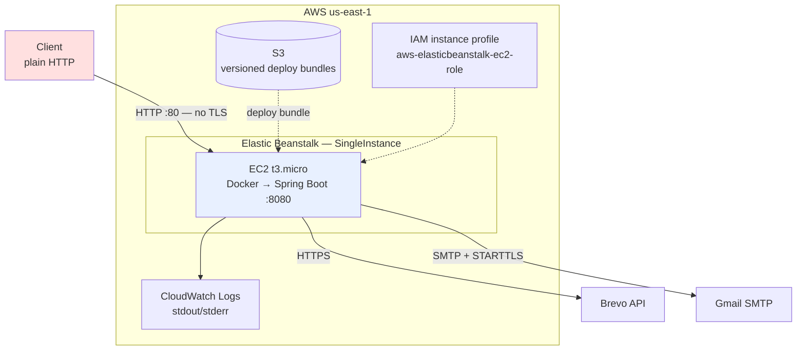
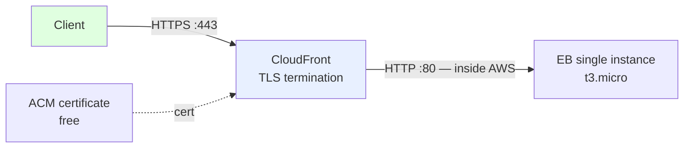

# AWS Architecture

What this repository actually deploys, what that costs, where it falls short, and how it would
reasonably evolve. Nothing here describes infrastructure that does not exist.

---

## Current deployment

A **single-instance Elastic Beanstalk environment** running the application as a Docker container
on one `t3.micro`, created and updated by [`eb-deploy.sh`](../eb-deploy.sh).

### What the deploy script does

1. Preflight: AWS CLI, `jq`, `zip`, valid credentials, **and that all four required secrets are
   present and long enough** — before anything is uploaded, so a missing value costs seconds
   rather than a failed rollout.
2. Creates or reuses the S3 bucket (versioning on), the EB application, and the IAM role plus
   instance profile.
3. Applies environment properties, then uploads a versioned bundle and deploys it.
4. Polls `/actuator/health` and prunes old application versions.

### Configuration and secrets

Secrets reach the application as **Elastic Beanstalk environment properties**, set by the deploy
script from the deploying shell's environment. They are never written to the repository, never
placed on a command line where `ps` would expose them, and are passed to the AWS API through a
mode-600 temporary file that is removed on exit.

| Variable | Purpose |
|---|---|
| `API_KEY_DEFAULT` | Client credential for `X-API-Key` |
| `BREVO_API_KEY` | Brevo authentication |
| `JWT_SECRET` | Signing key for approval links |
| `MAIL_PASSWORD` | Gmail app password |
| `APP_EMAIL_ALLOWEDLINKHOSTS` | Optional outgoing-link host allowlist |

**Limitation, stated plainly.** EB environment properties are visible to anyone with console or
API read access to the environment and appear in `describe-configuration-settings` output. They
are not encrypted at rest under a key you control, and there is no rotation or audit trail. That
is acceptable for a portfolio deployment and is *not* enterprise secret management — see
[Evolution](#evolution-path).

### IAM

The instance profile is `aws-elasticbeanstalk-ec2-role` with the AWS-managed
`AWSElasticBeanstalkWebTier` and `AWSElasticBeanstalkMulticontainerDocker` policies. The
application makes no AWS SDK calls, so it needs no application-level permissions of its own —
the role exists for the platform's own log shipping and bundle retrieval.

`AWSElasticBeanstalkMulticontainerDocker` is broader than this single-container deployment
requires and could be dropped.

### Health checks

EB enhanced health polls `/actuator/health`, which is deliberately public because a platform
probe cannot present credentials. It returns aggregate status only; component detail is not
exposed. There is no readiness/liveness distinction — Spring Boot's probes are not enabled, and
on a single instance with no load balancer the distinction would have nothing to act on it.

### Logging

Application logs go to stdout, which the platform captures and can stream to CloudWatch Logs.
There is no structured JSON output, no log-based alerting, and no retention policy set by this
repository.

---

## What is wrong with this today

| Issue | Consequence |
|---|---|
| **No TLS** | Request bodies, recipient addresses, message content, and API keys cross the network in cleartext. Approval JWTs travel in URL query strings, where they also land in proxy logs and browser history. |
| **Single instance** | Any deploy, crash, or instance replacement is full downtime. No rolling deployment, no rollback beyond redeploying a previous version. |
| **`t3.micro`, burstable** | Sustained load exhausts CPU credits and the instance throttles. |
| **No autoscaling** | Capacity is whatever one small instance provides. |
| **Secrets readable in the console** | Anyone with environment read access can read every credential. |
| **No WAF or rate limiting** | An authenticated client can exhaust the provider quota; nothing throttles request volume. |

**The TLS gap is the blocking one.** It is why this deployment must not carry real traffic, and
why the README does not describe the project as production-ready.

---

## Adding TLS without a load balancer

An Application Load Balancer is the textbook answer — it terminates TLS with a free ACM
certificate and brings health checks, rolling deploys, and multi-AZ with it. At roughly
**$16–18/month** for the ALB itself (the certificate is free), it is also the entire cost
difference, and it was declined for this project.

**Chosen alternative: CloudFront in front of the single instance.**

| | CloudFront | ALB | Let's Encrypt on the instance |
|---|---|---|---|
| Cost | ~$0 (1TB/mo free tier) | ~$16–18/mo | $0 |
| Certificate | ACM, free, auto-renewing | ACM, free, auto-renewing | Manual renewal |
| Client→edge TLS | Yes | Yes | Yes |
| Edge→origin TLS | **No** (unless the origin also gets a cert) | Yes | n/a |
| Survives instance replacement | Yes | Yes | **No** — cert is lost |

**The honest caveat:** CloudFront gives real HTTPS to clients, but the CloudFront→origin hop stays
plain HTTP unless a certificate is also placed on the instance. That traffic stays inside AWS's
network, which is a defensible position, but it is **not end-to-end TLS** and should never be
described as such. Restricting the origin security group to CloudFront's published prefix list
narrows the exposure further.

Let's Encrypt on the instance was rejected outright: renewal breaks on instance replacement, and
a portfolio should not showcase something that fails silently.

**Not implemented in this repository.** No CloudFront distribution, ACM certificate, or DNS
change is created by any script here. This section is a decision record, not a description of
running infrastructure.

---

## Evolution path

Roughly in the order the pain would actually appear.

### 1. TLS — required before any real traffic
CloudFront + ACM as above, then set `app.base-url` to `https://` so approval links stop being
emitted over plaintext.

### 2. Secrets into Parameter Store or Secrets Manager
Replace EB environment properties with **SSM Parameter Store `SecureString`** parameters, read at
startup via an IAM-scoped instance role. Parameter Store is free at this scale; Secrets Manager
costs about $0.40/secret/month and adds managed rotation. Either gives encryption under a KMS key
you control, an access audit trail in CloudTrail, and the ability to rotate a credential without a
redeploy — the three things environment properties do not provide.

### 3. Load-balanced, multi-AZ
Move from `SingleInstance` to `LoadBalanced` (min 2 across two AZs). This buys zero-downtime
rolling deploys, instance-failure survival, and end-to-end TLS. This is the point at which the ALB
cost becomes clearly worth paying.

### 4. CI/CD
GitHub Actions running `mvn verify` on pull requests, and deploying from `master` with a
short-lived OIDC role rather than long-lived access keys.

### 5. Observability
Ship structured JSON logs to CloudWatch with a retention policy, expose Micrometer metrics, and
alarm on the signals that matter: provider error rate, provider latency, and authentication
failure rate.

### 6. ECS/Fargate — only with a reason
Elastic Beanstalk is genuinely adequate for one containerised service. Fargate becomes worth the
migration when there are several services sharing infrastructure, when per-task IAM roles are
needed, when finer scaling control matters, or when the team already runs ECS. **Migrating for a
single service, to sound more sophisticated, would be a worse answer than staying on Beanstalk and
being able to explain why.**

### What breaks first at 10× traffic
The single instance's CPU credits, then the Tomcat worker pool if Brevo slows down, then Gmail's
daily send limit. Timeouts already prevent the second from cascading into total unavailability;
the first two need step 3, and the third needs the Gmail path to move onto a transactional
provider.

---

## Rollback

EB retains previous application versions in S3, so rollback is redeploying a prior version label.
On a single instance that is downtime for the duration, and there is no automated trigger — a
failed health check does not roll back on its own. A load-balanced environment with rolling
deployments would make this a non-event, which is another argument for step 3.
