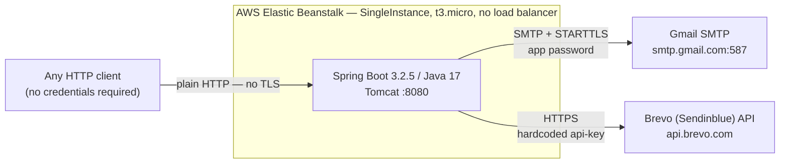
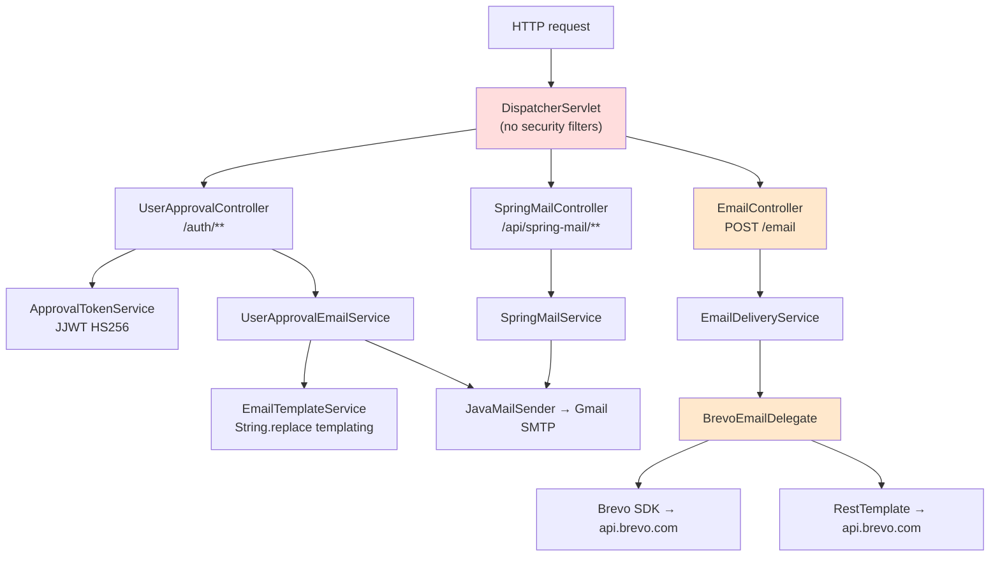

# Engineering Audit — Email Integrator

**Audit date:** 2026-08-07
**Commit audited:** `40995eb` (branch `master`, working tree clean)
**Method:** Static review of all tracked source, configuration, build, and deployment files; `mvn clean test`; `mvn dependency:list`/`dependency:tree`; full `git` history scan for committed secrets; DNS resolution of the hostnames the README advertises. No production HTTP requests were issued and no application code was modified.

> **Source of truth for this audit is the code and configuration, not the README.** Where the two disagree, the disagreement is itself recorded as a finding.

---

## Resolution status

**This document is a point-in-time snapshot of commit `40995eb` and is deliberately not rewritten as work lands** — the findings are the record of what was actually wrong. The table below tracks what has since been fixed, so nothing here is mistaken for a description of the current code.

Everything below this section describes the repository **as audited**, not as it stands today.

| ID | Finding | Status |
|---|---|---|
| CRIT-1 | No authentication on any endpoint | **Fixed** — `280bb20` |
| CRIT-2 | Unauthenticated open relay with attacker-controlled links | **Fixed** — `280bb20`, `e502ff4` |
| CRIT-3 | Hardcoded API key literal in source | **Fixed** — `ac68a2a` |
| CRIT-4 | API key written to standard output | **Fixed** — `ac68a2a` |
| CRIT-5 | Live Gmail app password in the working tree | **Open — requires manual action.** The credential must be rotated in the Google Account console and `production-secrets-backup.txt` deleted. No commit can do this. |
| CRIT-6 | JWT signing key defaults to a published value | **Fixed** — `2b8b626` |
| HIGH-1 | No timeout on any outbound call | **Fixed** (Brevo path) — `ac68a2a` |
| HIGH-2 | README claims unsupported by the code | **Fixed** — `9c0d623` |
| HIGH-3 | `POST /email` non-functional demo code | **Fixed** — `ac68a2a` |
| HIGH-4 | HTML injection in email templates | **Fixed** — `e502ff4` |
| HIGH-5 | No input validation | **Partially fixed** — `/email` only; the Gmail endpoints still take `Map` bodies |
| HIGH-6 | No centralized exception handling | **Fixed** — `ac68a2a` |
| HIGH-7 | No TLS | **Open** — decision recorded in [AWS_ARCHITECTURE.md](AWS_ARCHITECTURE.md); not implemented |
| HIGH-8 | Effectively no tests, no CI | **Partially fixed** — 1 test → 122; **CI still does not exist** |
| HIGH-9 | Caller-controlled `From` enables spoofing | **Partially fixed** — `/email` cannot set a sender; `SpringMailService` still can |
| MED-2 | Stale dependencies, build tooling on the runtime classpath | **Partially fixed** — the Maven 2.0.6 subtree is gone with the SDK; Spring Boot is still 3.2.5 and nothing scans dependencies |
| MED-5 | Weak operational diagnostics | **Partially fixed** — the fake `/api/spring-mail/health` is removed; no metrics or real `HealthIndicator` yet |
| MED-9 | Dead and duplicated code | **Mostly fixed** — SMS path, unused DTOs, and `isTokenExpired` removed |
| MED-10 | `.env` present but unreadable by Spring; no `.env.example` | **Fixed** — `280bb20` |

A newly discovered defect not in the original audit: **Apache HttpClient 5 was silently retrying non-idempotent email sends**, arriving transitively through Spring Cloud Vault. Found by a test that hung; recorded in [ADR 0002](adr/0002-no-automatic-retries-on-email-send.md).

Everything not listed above remains as originally assessed.

---

## Executive Summary

### Classification: **Prototype**

Not "production-ready." Not yet a "production-oriented portfolio application."

This is an honest classification, and the gap is not a matter of polish — it is structural:

| Capability the README claims | Actual state in the repository |
|---|---|
| "✅ PRODUCTION READY" | No authentication, no TLS, no CI, no tests, no timeouts |
| "JWT Authentication: Implemented and secure ✅" | **No authentication exists on any endpoint.** `spring-boot-starter-security` is not a dependency. JWT is used only to sign approval *links*, never to authenticate a caller |
| "Thymeleaf – HTML email templating" | **Thymeleaf is not a dependency.** Templating is `String.replace("{{key}}", value)` |
| "Error Handling: Comprehensive" | No `@ControllerAdvice`, no error contract; raw `e.getMessage()` is returned to clients |
| "✅ LIVE & OPERATIONAL" | Accurate — and that is the problem. See CRIT-1/CRIT-2 |

The strongest evidence that the "production ready" claim is unsupported comes from the README itself: its own *Future Enhancements* list contains unchecked boxes for `Implement Basic Auth`, `Add Junit Tests`, `Add Github Actions`, and `Secret scan`. The document simultaneously claims the work is done and admits it is not.

### The one thing that must be dealt with today

`email-integrator-prod.eba-p4bnt2xm.us-east-1.elasticbeanstalk.com` and `api.email.hoseacodes.com` **both resolve to 3.220.92.38**. The service is live on the public internet with:

- zero authentication on every endpoint, and
- an endpoint that will send HTML email, from your real `info@ambitiousconcept.com` mailbox, to **any recipient an anonymous caller names**, containing **any link an anonymous caller supplies**.

That is a functioning open phishing relay attached to your own sending reputation. It is not a portfolio problem; it is an active operational and deliverability risk. Remediation is discussed in CRIT-1 and CRIT-2, and the fastest mitigation is to take the environment down or firewall it while the fixes land.

### What this repository *does* show

Real, non-trivial work sits underneath the problems: a layered package structure, a genuine third-party SDK integration, a working templated-email pipeline with seven real HTML templates, a substantial hand-written AWS deployment script, ICS calendar generation, and correct modern JJWT 0.12.x API usage. The raw material for a strong portfolio project is here. The issue is that the wiring between the layers is unfinished and the documentation asserts completion that the code does not deliver.

### Recommended honest positioning, today

> "A Spring Boot email-integration service exploring templated transactional email, third-party provider integration, and AWS deployment. Portfolio project — see Known Limitations."

and once the P0 work in the hardening plan is done:

> "A production-oriented portfolio project demonstrating authenticated API design, resilient third-party integration, and operational readiness practices."

---

## Current Architecture

### System context



There is no security filter chain in this diagram because there is no security filter chain in the application. The conceptual flow the brief proposed — `Client → Spring Security → Controller → Service → Integration Client → Provider` — is missing its second hop entirely.

### Actual request flow



### Two parallel, unrelated integration paths

This is the most important architectural observation in the audit. The service contains **two entirely separate email pipelines that share no abstraction, no error model, and no response shape**:

| | Path A — Gmail SMTP | Path B — Brevo API |
|---|---|---|
| Entry points | `/auth/**`, `/api/spring-mail/**` | `POST /email` |
| Transport | `JavaMailSender` (SMTP) | Brevo SDK + a second raw `RestTemplate` call |
| Service | `UserApprovalEmailService`, `SpringMailService` | `EmailDeliveryService` → `BrevoEmailDelegate` |
| Failure signalling | returns `boolean` / `SimpleEmailResponse(success=false)` | throws checked `ApiException` up through the controller |
| Response DTO | `SimpleEmailResponse` | `EmailResponse` |
| Working? | Yes | **No — see HIGH-3** |

There is no `EmailProvider` interface. `EmailDeliveryService` — the class whose name promises the abstraction — is a five-line pass-through that `@Autowired`s the concrete `BrevoEmailDelegate` and rethrows. `BrevoEmailDelegate` itself uses *two different HTTP mechanisms* against the same vendor: the Sendinblue SDK for single sends and a hand-rolled `RestTemplate.exchange()` for batch sends, each authenticating differently.

### Package structure

```
com.hoseacodes.emailintegrator
├── EmailintegratorApplication.java
├── config/          AppConfiguration, BrevoConfiguration, EmailProperties,
│                    MailConfig, VaultConfiguration
├── controller/      EmailController, SpringMailController, UserApprovalController
├── model/           10 classes — request DTOs, response DTOs and domain objects,
│                    all mixed in one package
├── service/         ApprovalTokenService, EmailDeliveryService, EmailTemplateService,
│                    SpringMailService, UserApprovalEmailService
└── brevo/
    ├── delegate/    BrevoEmailDelegate
    └── model/
        ├── EMSParams
        └── Batch/   7 provider wire-model classes  ← uppercase package name
```

The layer *names* are right. The layer *boundaries* are not enforced: `UserApprovalController` contains ~140 lines of request parsing, field validation, and template-type dispatch that belong in a service, and `brevo.model.Batch` types are reachable from the public API surface via `EmailInput.batchInput`, so Brevo's wire format is part of your published contract.

---

## Strengths

Worth stating plainly, because these are real and they are what makes the project worth hardening rather than restarting.

1. **Correct modern JJWT usage.** `ApprovalTokenService` uses the 0.12.x builder API (`.claims()`, `.signWith()`, `Jwts.parser().verifyWith()`), not the deprecated 0.11 style. It verifies the signature *and* checks a `type` claim before trusting the payload — that second check is a genuinely good instinct that many candidates miss, and it prevents an approval token from being swapped in where a different token type was expected.

2. **Configuration is externalised through the right Spring mechanisms.** `@ConfigurationProperties` (`EmailProperties`, `BrevoConfiguration`) and `@Value` with defaults, plus `${MAIL_PASSWORD:}` env-var indirection. The *pattern* is correct; the discipline around it is what fails (CRIT-3, CRIT-6).

3. **No secrets have ever been committed to git.** I scanned every blob in every commit on every ref for Brevo, AWS, Stripe, GitHub and PEM key patterns: clean. `.gitignore` covers `.env`, `.env.*`, and `production-secrets-backup.txt`. Given how easily this goes wrong, this deserves credit — and it means the remediation in CRIT-5 is a rotation, not a history rewrite.

4. **Template loading degrades instead of failing.** `EmailTemplateService.processTemplate()` catches `IOException` and falls back to an inline default template per type. Choosing degraded output over a 500 for a non-critical presentation concern is sound reliability thinking.

5. **The deployment script is real engineering.** `eb-deploy.sh` is 400+ lines with `set -euo pipefail`, dependency preflight checks, idempotent create-or-reuse logic for the S3 bucket / EB application / IAM role / instance profile, artifact upload, versioned releases, and a polling post-deploy health check. Most portfolio projects have `README: "deploy it to AWS"`. This has a script that actually does it.

6. **`ConsultationData.generateCalendarEvent()` produces genuine RFC 5545 ICS** with correct CRLF line endings, `UID`, `DTSTAMP`, `ORGANIZER` and `ATTENDEE;RSVP=TRUE`. It is attached as `text/calendar` via `MimeMessageHelper`. This is a detail-oriented piece of work.

7. **Structured SLF4J logging in the newer classes**, with parameterised placeholders rather than string concatenation — in `SpringMailService`, `UserApprovalEmailService`, and both newer controllers.

---

## Weaknesses

What a senior reviewer will question, in the order they will notice it.

1. **There is no authentication.** This is the first thing a reviewer greps for and the first thing they will find missing. It reframes everything else on the page.
2. **The README's central claims are contradicted by the code**, including by the README's own to-do list. Once a reviewer catches one unsupported claim, they discount every other claim in the document — including the true ones.
3. **`POST /email` is broken demo code**, still wired to a live controller. It ignores its own input and mails a hardcoded personal address.
4. **A credential literal sits in committed source**, with the correctly-configured value commented out directly above it.
5. **One test, and it asserts nothing.** For a service whose entire value proposition is integration reliability, this is the loudest possible signal.
6. **No timeout is configured on any outbound call** — SMTP, `RestTemplate`, or SDK.
7. **The Vault dependency is inert.** `spring.cloud.vault.enabled=false`, and `VaultConfiguration` binds `example.username`/`example.password` — the property names from the Spring Cloud Vault getting-started guide. Documentation nonetheless references "Vault Email Setup."
8. **`GET` endpoints cause side effects.** `/auth/approve` and `/auth/deny` mutate state and send email on a GET.
9. **Business logic lives in controllers.** `UserApprovalController` is 373 lines, most of it `Map<String,Object>` unpacking and null-checking.
10. **`Map<String,String>` is used as a request body in three endpoints**, which forfeits schema, validation, and OpenAPI documentation simultaneously.

---

## Risk Register

Severity reflects real-world consequence given that **the service is currently live and unauthenticated**, not textbook severity.

Complexity is engineering effort: **S** ≈ under an hour · **M** ≈ half a day · **L** ≈ a day or more.
Portfolio value is how much the fix demonstrates senior judgment to a reviewer.

---

### CRITICAL

---

#### CRIT-1 — No authentication or authorization on any endpoint

**Issue.** `spring-boot-starter-security` is absent from `pom.xml`. There is no `SecurityFilterChain`, no filter, no `@PreAuthorize`, no API key check. Every endpoint is reachable anonymously, including the two explicitly documented as administrative:

| Endpoint | Method | Documented intent | Actual protection |
|---|---|---|---|
| `/auth/manual-approve` | POST | *"Manually approve user by admin"* | none |
| `/auth/manual-deny` | POST | *"Manually deny user by admin"* | none |
| `/auth/send-email` | POST | send any template to anyone | none |
| `/auth/approve`, `/auth/deny` | GET | token-gated | token only |
| `/api/spring-mail/send`, `/send-simple` | POST | send arbitrary email | none |
| `/email` | POST | Brevo send | none |
| `/actuator/health`, `/actuator/info` | GET | health | none |

The `manual-*` endpoints are the sharpest illustration: the Javadoc says "by admin," the code asks for nothing. Whatever authorization model was intended was never written.

**Why it matters.** Authentication is the boundary every other control depends on. Rate limiting, audit logging, per-caller quotas, and abuse attribution are all impossible without a caller identity. And because this is live, the exposure is not hypothetical.

There is a second-order effect specific to a portfolio: the README claims *"JWT Authentication: Implemented and secure ✅"*. A reviewer who greps for `SecurityFilterChain`, finds nothing, and re-reads that line does not conclude "incomplete project." They conclude "claims I cannot trust." That is a far more expensive outcome than a missing feature.

**Affected files.** [pom.xml](pom.xml) · [EmailController.java](src/main/java/com/hoseacodes/emailintegrator/controller/EmailController.java) · [SpringMailController.java](src/main/java/com/hoseacodes/emailintegrator/controller/SpringMailController.java) · [UserApprovalController.java](src/main/java/com/hoseacodes/emailintegrator/controller/UserApprovalController.java) · [application.properties](src/main/resources/application.properties)

**Recommended solution.** Add `spring-boot-starter-security` and a single explicit `SecurityFilterChain`: deny by default, permit `/actuator/health` and the OpenAPI paths, and require an authenticated caller everywhere else. For a machine-to-machine email API, a validated static API key in a header via a small `OncePerRequestFilter` is the *honest* design and is easy to defend in interview — a JWT bearer flow with no identity provider and no user store would be pattern-collecting. Keep the existing JJWT code for what it actually is: signed one-time approval links, which is a legitimate and separate concern.

**Complexity:** M · **Portfolio value:** Very high — this is the single change that moves the classification from prototype toward production-oriented.

---

#### CRIT-2 — Unauthenticated open email relay with attacker-controlled links (live)

**Issue.** `POST /auth/send-email` accepts, with no authentication and no validation:

- `email` — the recipient, arbitrary
- `templateType` — selects the template
- `approvalUrl`, `denyUrl`, `loginUrl`, `resetUrl`, `meetingLink` — **URLs placed directly into the email body**
- `appName`, `appDisplayName`, `name` — display strings placed into the body

Those values reach [`EmailTemplateService.replaceVariables()`](src/main/java/com/hoseacodes/emailintegrator/service/EmailTemplateService.java#L48-L58), which performs raw `String.replace()` into an HTML document with **no escaping of any kind**, and the result is sent as `text/html` from `info@ambitiousconcept.com` over your authenticated Gmail connection.

The `password-reset` template is the worst case. An anonymous caller supplies a victim address and their own `resetUrl`, and your domain delivers a password-reset email with the attacker's link.

Because there is no escaping, the injection is not limited to the URL slot — a value containing `">` closes the attribute and injects arbitrary markup into the message body.

**Why it matters.** Three compounding consequences:

- **Phishing from a trusted sender.** Mail carrying your domain's SPF/DKIM alignment is far more likely to land in an inbox and be believed than mail from a throwaway domain.
- **Sender reputation destruction.** Spam complaints attach to `ambitiousconcept.com` and to the Gmail account. Domain reputation is slow to rebuild and Google will suspend the account for bulk unsolicited mail.
- **Quota and cost exhaustion.** Gmail enforces daily send limits; an abuser exhausts them, and legitimate mail stops.

**Affected files.** [UserApprovalController.java:207-360](src/main/java/com/hoseacodes/emailintegrator/controller/UserApprovalController.java#L207-L360) · [EmailTemplateService.java:48-58](src/main/java/com/hoseacodes/emailintegrator/service/EmailTemplateService.java#L48-L58) · [UserApprovalEmailService.java](src/main/java/com/hoseacodes/emailintegrator/service/UserApprovalEmailService.java) · all seven files in [templates/](src/main/resources/templates/)

**Recommended solution.** Four layers, in this order:

1. **Authenticate the endpoint** (CRIT-1). This alone closes the anonymous path.
2. **HTML-escape every substituted value** before insertion. Adopting Thymeleaf gives contextual escaping by default and would also make the README's existing Thymeleaf claim true — a rare case where the fix and the documentation converge.
3. **Validate and allowlist caller-supplied URLs** — require `https`, and require the host to match a configured set of permitted domains. A caller should not be able to point your password-reset link at an arbitrary host.
4. **Rate-limit per caller**, once callers are identifiable.

**Complexity:** M · **Portfolio value:** Very high — "I found an injection path in my own code, reasoned about the blast radius, and fixed it in defence-in-depth layers" is one of the strongest stories you can tell in a security conversation.

---

#### CRIT-3 — Hardcoded API key literal in committed source, overriding configuration

**Issue.** [`BrevoEmailDelegate.setBrevoAPIKey()`](src/main/java/com/hoseacodes/emailintegrator/brevo/delegate/BrevoEmailDelegate.java#L102-L111):

```java
String brevoApiKey = brevoConfiguration.getApikey();
System.out.println(brevoApiKey);       // ← CRIT-4
// apiKey.setApiKey(brevoApiKey);      // ← the correct line, commented out
apiKey.setApiKey("<16-char literal>"); // ← a credential literal, in a public repo
System.out.println(apiKey.getApiKey());// ← CRIT-4
```

The properly externalised value is read, printed, and then **discarded in favour of a string literal**. This is committed and public.

The literal is redacted here rather than reproduced: a document describing a credential leak should not itself republish the credential. The value is in git history at `BrevoEmailDelegate.java:108` prior to commit `40995eb` if you need it for revocation.

Its format does not match Brevo's `xkeysib-` key convention, so it is most likely a leftover debugging placeholder rather than a live key — but that determination is yours to make, not a reviewer's to guess. Treat it as live until you have confirmed otherwise in the Brevo console.

**Why it matters.** Independently of whether this particular string is valuable, a hardcoded credential that *overrides* the correct configuration is the exact pattern secret-scanning tooling exists to catch, and it is what a reviewer will point at when asked "did this candidate handle secrets carefully?" The commented-out correct line makes it worse, not better: it demonstrates the right answer was known and then bypassed.

**Affected files.** [BrevoEmailDelegate.java:102-111](src/main/java/com/hoseacodes/emailintegrator/brevo/delegate/BrevoEmailDelegate.java#L102-L111)

**Recommended solution.** Delete the literal, restore `apiKey.setApiKey(brevoApiKey)`, and fail fast at startup if the key is absent rather than silently sending with a null key. Verify in the Brevo console whether the literal ever corresponded to a real key; revoke it if so. History rewriting is not required — no *real* secret was ever committed (see Strength 3) — but the literal should be removed from the working tree regardless.

**Complexity:** S · **Portfolio value:** High — as a *fixed* finding with a written rationale.

---

#### CRIT-4 — API key written to standard output

**Issue.** [`BrevoEmailDelegate.java:106` and `:109`](src/main/java/com/hoseacodes/emailintegrator/brevo/delegate/BrevoEmailDelegate.java#L106-L109) print the Brevo API key to stdout on **every single send**. On Elastic Beanstalk, stdout is captured, written to the instance log files, and forwarded to CloudWatch Logs when log streaming is enabled.

**Why it matters.** Credentials in logs are credentials in every downstream system that touches those logs: CloudWatch, S3 archives, any aggregator, and anyone with read access to any of them. Log retention outlives credential rotation, so the exposure persists after the key is changed. Log access is also typically granted far more broadly than secret access — which is precisely why this class of leak is so damaging.

**Affected files.** [BrevoEmailDelegate.java:106,109](src/main/java/com/hoseacodes/emailintegrator/brevo/delegate/BrevoEmailDelegate.java#L106-L109) — and 14 further `System.out.println` / `printStackTrace` calls in the same class (MED-4).

**Recommended solution.** Remove both lines. Replace all `System.out`/`printStackTrace` in the class with SLF4J at appropriate levels. Establish and document the rule that credentials, tokens, and `Authorization` headers are never logged at any level.

**Complexity:** S · **Portfolio value:** High — pairs naturally with the logging-hygiene section of `docs/OPERATIONS.md`.

---

#### CRIT-5 — Live Gmail app password in plaintext in the working tree

**Issue.** `production-secrets-backup.txt` in the repository root contains the Gmail app password for `info@ambitiousconcept.com` in plaintext, alongside JWT secrets. The file's own comments state the password *"was found in shell history."*

**It is `.gitignore`d and was never committed** — I verified this against every blob in the full history. The git risk is nil. The credential risk is not.

**Why it matters.** A Gmail app password bypasses 2FA entirely. Anyone holding it can send mail as you and, depending on scope, read mail. Two facts make this urgent independently of the file:

- The password was already exposed in **shell history**, which is itself a plaintext file, often backed up, and frequently synced.
- The file sits in a directory you routinely operate on — one mis-scoped `git add -A` after a `.gitignore` edit, one directory upload, one backup tool, and it is public.

**This credential should be rotated regardless of what else is done in this repository.** It has been in at least two plaintext locations and should be considered compromised.

**Affected files.** `production-secrets-backup.txt` · `.env` (both untracked, both correctly ignored)

**Recommended solution.**
1. **Rotate now** — revoke the app password in the Google Account security console and issue a new one. Do this before anything else in this audit.
2. Delete `production-secrets-backup.txt`. It has no legitimate purpose; it is a plaintext secret store with a note explaining where it was scavenged from.
3. Keep `.env` untracked, and add a committed `.env.example` with placeholders only.
4. Clear the shell-history entry (`~/.zsh_history`).
5. In AWS, keep runtime secrets in EB environment properties at minimum, and document Secrets Manager / SSM Parameter Store as the production path in `docs/SECURITY.md`.

**Complexity:** S · **Portfolio value:** Medium directly — but very high as an interview narrative about credential lifecycle and blast-radius reasoning.

---

#### CRIT-6 — JWT signing key defaults to a value published in this repository

**Issue.** Three compounding defects in one credential path.

*First*, the fallback chain is publicly known. [`application.properties:37`](src/main/resources/application.properties#L37):

```properties
app.jwt.secret=${JWT_SECRET:default-secret-key-change-in-production}
```

and [`ApprovalTokenService.java:22`](src/main/java/com/hoseacodes/emailintegrator/service/ApprovalTokenService.java#L22) declares a second fallback, `mySecretKey`. Both strings are in a public repository.

*Second*, **nothing provisions `JWT_SECRET` in production.** `eb-deploy.sh` writes exactly one environment property — `SERVER_PORT` ([eb-deploy.sh:254](eb-deploy.sh)) — and never sets `JWT_SECRET` or `MAIL_PASSWORD`. Unless it was set out-of-band through the console (undocumented anywhere in the repository), **the live service is signing approval tokens with `default-secret-key-change-in-production`.**

*Third*, there is no length validation. `Keys.hmacShaKeyFor(jwtSecret.getBytes())` requires ≥256 bits for HS256; both fallbacks are shorter and would throw `WeakKeyException` at first use — which means the failure surfaces as a runtime 500 on the first approval email rather than as a refusal to start.

**Why it matters.** The signing key is the *entire* security of a JWT. If an attacker knows it, they mint tokens your service accepts as genuine — here, forging `/auth/approve?token=...` for any email address. And because the deploy script never sets it, this is not a "someone might forget in production" hypothetical; the deployment path structurally cannot supply it.

Note the interaction with CRIT-1: the approval token is currently the *only* access control anywhere in the application, and it rests on a key printed in the README's own repository.

**Affected files.** [ApprovalTokenService.java:22-30](src/main/java/com/hoseacodes/emailintegrator/service/ApprovalTokenService.java#L22-L30) · [application.properties:37](src/main/resources/application.properties#L37) · [eb-deploy.sh](eb-deploy.sh)

**Recommended solution.** Remove both insecure defaults so the property is mandatory, and **fail fast at startup** if it is missing or shorter than 32 bytes — a `@PostConstruct` check or a `@ConfigurationProperties` bean with `@NotBlank`/`@Size(min=32)`. A service that refuses to start beats a service that starts insecurely; the failure is loud, immediate, and impossible to miss. Then extend `eb-deploy.sh` to set the environment properties it needs, sourcing them from the environment rather than from a file. Add `iss` (issuer) and consider `aud` (audience) claims and validate them, so tokens minted by another of your services are not accepted here.

**Complexity:** S–M · **Portfolio value:** Very high — fail-fast configuration validation is a hallmark of production-minded Spring work and is very defensible in interview.

---

### HIGH

---

#### HIGH-1 — No timeout on any outbound network call

**Issue.** Every outbound call in the application can block indefinitely.

| Call site | Configuration | Default |
|---|---|---|
| [`AppConfiguration.restTemplate()`](src/main/java/com/hoseacodes/emailintegrator/config/AppConfiguration.java#L8-L11) | `new RestTemplate()` — bare | **infinite** connect and read |
| [`MailConfig.getJavaMailSender()`](src/main/java/com/hoseacodes/emailintegrator/config/MailConfig.java#L26-L44) | no `mail.smtp.*timeout` properties | **infinite** connection, I/O and write |
| Brevo SDK (`TransactionalEmailsApi`) | uses SDK default `ApiClient` | SDK-managed, unconfigured |

`grep -riE "timeout|ConnectTimeout|ReadTimeout|RequestFactory"` over `src/main` returns nothing.

**Why it matters.** This is the classic cascading-failure mechanism, and it is materially worse here because of the deployment topology. Tomcat has a bounded worker pool (200 by default). Every request blocked on a hung socket holds a worker. If Brevo or Gmail becomes slow rather than unavailable — the common failure mode, and the dangerous one, because a *down* dependency fails fast while a *slow* dependency ties up resources — workers accumulate until the pool is exhausted. At that point the service stops answering **every** endpoint, including `/actuator/health`. EB's health check then fails and the instance is replaced, dropping in-flight work.

The environment is `SingleInstance` on a `t3.micro` ([eb-deploy.sh:244-247](eb-deploy.sh)): one instance, no load balancer, no capacity to absorb this.

The rule worth internalising: **an outbound call without a timeout is an unbounded resource commitment to a system you do not control.**

**Affected files.** [AppConfiguration.java](src/main/java/com/hoseacodes/emailintegrator/config/AppConfiguration.java) · [MailConfig.java](src/main/java/com/hoseacodes/emailintegrator/config/MailConfig.java) · [BrevoEmailDelegate.java](src/main/java/com/hoseacodes/emailintegrator/brevo/delegate/BrevoEmailDelegate.java)

**Recommended solution.** Build `RestTemplate` through `RestTemplateBuilder` with explicit connect and read timeouts (5s / 10s are sensible starting points and should be configuration properties, not literals). Set `mail.smtp.connectiontimeout`, `mail.smtp.timeout`, and `mail.smtp.writetimeout` in `MailConfig`. Configure the Brevo SDK's `ApiClient` timeouts explicitly rather than inheriting them.

Note deliberately that **timeouts come before retries** in the remediation order: adding retries to calls that can hang forever multiplies the problem instead of solving it. Retry semantics for a non-idempotent send operation are analysed separately in Phase 5/6 and must not be added reflexively.

**Complexity:** S · **Portfolio value:** Very high — timeout reasoning is a standard senior interview probe, and the "slow is worse than down" explanation is exactly what distinguishes a senior answer.

---

#### HIGH-2 — README makes claims the repository does not support

**Issue.** Catalogued, with evidence:

| Claim | Location | Reality |
|---|---|---|
| "✅ PRODUCTION READY" | README:5-7, 162, 195, 204 | No auth, no TLS, no CI, no tests, no timeouts |
| "JWT Authentication: Implemented and secure ✅" | README:200 | No authentication exists (CRIT-1); key defaults to a published string (CRIT-6) |
| "Thymeleaf – HTML email templating" | README:150 | **Not a dependency.** Templating is `String.replace` |
| "Error Handling: Comprehensive ... null-safe" | README:168, 201 | No `@ControllerAdvice`; `e.getMessage()` returned to clients (HIGH-6) |
| "Health Monitoring" | README:167 | `/actuator/health` only, with `show-details=when-authorized` and no security, so details never render |
| "`[ ] Add Swagger`" | README:177 | springdoc **is** a dependency — the list is stale in the other direction |
| Base URLs are `http://` | README:11-12 | Accurate, and itself a finding (HIGH-7) |

The internal contradiction is the most damaging part: line 200 claims JWT authentication is implemented and secure, while line 174 lists `[ ] Implement Basic Auth` as outstanding.

**Why it matters.** Documentation is a work product, and for a consulting engagement it is *the* work product a client sees most. A reviewer assessing you for consulting work reads an overclaiming README as evidence about how you will describe delivery status on their project. Accurate self-assessment — "here is what works, here is what does not, here is why" — reads as more senior than a green checklist, not less.

**Affected files.** [README.md](README.md)

**Recommended solution.** Rewrite (Phase 22) with the rule that every claim traces to code or configuration. Replace "production ready" with an accurate classification, delete the Thymeleaf claim (or make it true per CRIT-2), and add a candid *Known Limitations* section. A reviewer who sees you documenting your own gaps trusts everything else you wrote.

**Complexity:** M · **Portfolio value:** Very high — cheap to fix, and it is the difference between a reviewer trusting the repository or discounting it.

---

#### HIGH-3 — `POST /email` is non-functional demo code wired to a live endpoint

**Issue.** [`BrevoEmailDelegate.convertSmtpInput()`](src/main/java/com/hoseacodes/emailintegrator/brevo/delegate/BrevoEmailDelegate.java#L126-L149) **discards its input** and constructs a fixed message:

```java
emailInput.setSubject("Welcome to Brevo");                   // hardcoded
sender.setEmail("info@ambitiousconcpets.com");               // hardcoded AND misspelled
replyTo.setEmail("ann6533@example.com");                     // placeholder from the SDK sample
to.setEmail("mr.dhosea@gmail.com");                          // your personal address, hardcoded
```

The only use of the `input` parameter is interpolating `getCompanySignature()` into a "Welcome to Brevo" greeting. Regardless of what a caller posts, this endpoint mails *you* a Brevo sample message — the sender domain is misspelled (`ambitiousconcpets` vs `ambitiousconcept`), which will fail SPF/DKIM alignment.

`convertSmSInput()` (lines 113-124) is worse: empty sender, empty recipient, hardcoded body, reached from `callBrevoSMS()`, which nothing calls.

**Why it matters.** This is the finding most likely to end a review early. A reviewer opening the integration layer — the layer the project is *named* for — finds tutorial sample code with a personal email address hardcoded in it, still routed from a live `@PostMapping`. It reads as abandoned scaffolding, and it undermines the credibility of the working Gmail path, which a reviewer may never reach.

Note also the personal-email exposure: `mr.dhosea@gmail.com` is published in a public repository.

**Affected files.** [BrevoEmailDelegate.java:113-149](src/main/java/com/hoseacodes/emailintegrator/brevo/delegate/BrevoEmailDelegate.java#L113-L149) · [EmailController.java](src/main/java/com/hoseacodes/emailintegrator/controller/EmailController.java) · [EmailDeliveryService.java](src/main/java/com/hoseacodes/emailintegrator/service/EmailDeliveryService.java)

**Recommended solution.** Decide, explicitly, and document the decision:

- **Option A — implement it.** Make `convertSmtpInput` map real input, replace `EmailInput` with a proper request DTO, and give Brevo a genuine adapter behind a shared interface (Phase 28). Highest value; also the most work.
- **Option B — remove it.** Delete the Brevo path, the SMS dead code, and the `sib-api-v3-sdk` dependency; keep the Gmail path and do it well. **This is the right call if time is limited** — a small, complete, correct service is a stronger portfolio artifact than a large one with a broken half. Deleting dead code is a senior instinct and is defensible in interview.

Either way the SMS code goes: it is entirely unreachable.

**Complexity:** S (remove) / L (implement) · **Portfolio value:** Very high either way — leaving it as-is is the single most damaging option.

---

#### HIGH-4 — HTML injection in email templates

**Issue.** [`EmailTemplateService.replaceVariables()`](src/main/java/com/hoseacodes/emailintegrator/service/EmailTemplateService.java#L48-L58) substitutes caller-controlled values into HTML with `String.replace()` and no escaping. Reached from every `sendXxxEmail` method in `UserApprovalEmailService`. The injectable fields include `userName`, `appName`, `appDisplayName`, `company`, `notes`, `firstName`, `lastName`, and every URL slot.

A `notes` value of `"><script>...` or `" onmouseover="...` escapes its attribute or element context and injects arbitrary markup into the message body.

**Why it matters.** The immediate impact is phishing content in mail carrying your domain's authentication (CRIT-2), not browser XSS — modern mail clients sanitise aggressively and strip `<script>`. But sanitisation is a property of the *recipient's* client, not a control you own, and `<a href>` and CSS-based deception survive it comfortably. Relying on a third party's filter is not a security posture.

A related instance: `ConsultationData.generateCalendarEvent()` concatenates unescaped `company`, `notes`, and `meetingLink` into ICS content, where CRLF sequences are field separators — the same injection class in a different grammar.

**Affected files.** [EmailTemplateService.java:48-58](src/main/java/com/hoseacodes/emailintegrator/service/EmailTemplateService.java#L48-L58) · [ConsultationData.java:154-200](src/main/java/com/hoseacodes/emailintegrator/model/ConsultationData.java#L154-L200) · [templates/](src/main/resources/templates/)

**Recommended solution.** Adopt Thymeleaf, which escapes by default and is context-aware — and which makes the existing README claim true. If keeping the hand-rolled approach, escape every value with `HtmlUtils.htmlEscape()` before substitution and treat URL slots separately with scheme/host validation. Escape or reject CRLF in ICS fields.

**Complexity:** M · **Portfolio value:** High — output encoding is context-dependent, and demonstrating you know HTML, URL, and ICS contexts differ is a strong signal.

---

#### HIGH-5 — No input validation anywhere

**Issue.** `grep -rn "@Valid\|@NotNull\|@NotBlank\|@Email\|@Size"` over `src/main/java` returns **zero matches**. `spring-boot-starter-validation` is not a dependency — `jakarta.validation-api` appears only transitively via swagger-core, with no Hibernate Validator implementation, so annotations would be silently inert even if added.

Three endpoints take `Map<String,String>` or `Map<String,Object>` as the request body, so there is no schema at all. Validation is hand-rolled null-checking scattered through controllers ([UserApprovalController:309-313](src/main/java/com/hoseacodes/emailintegrator/controller/UserApprovalController.java#L309-L313) checks eight fields in one `if`).

Consequences: no email-format checking anywhere (`helper.setTo(...)` throws on a malformed address, surfacing as a 500 rather than a 400); no length bounds, so a caller can post a multi-megabyte `htmlContent` or a 10,000-entry `to` list; no rejection of empty strings; `Map<String,String>` bodies produce empty OpenAPI schemas (MED-7).

**Why it matters.** Validation is where a well-designed API states its contract. Without it, malformed input becomes a 500 that looks like a server defect, callers cannot tell what a valid request looks like, unbounded fields become a memory-pressure vector on a `t3.micro`, and `@RequestBody Map` forfeits schema, validation, and documentation in a single stroke.

**Affected files.** [pom.xml](pom.xml) · all three controllers · [SimpleEmailRequest.java](src/main/java/com/hoseacodes/emailintegrator/model/SimpleEmailRequest.java) · [EmailInput.java](src/main/java/com/hoseacodes/emailintegrator/model/EmailInput.java)

**Recommended solution.** Add `spring-boot-starter-validation`. Replace `Map` bodies with typed request DTOs (Java records) annotated with `@NotBlank`, `@Email`, `@Size`, `@Valid` on nested types and collections. Add `@Valid` at controller parameters and map `MethodArgumentNotValidException` to a 400 with per-field errors in the standard error shape (HIGH-6). Set `server.max-http-request-header-size` and an explicit body-size limit.

**Complexity:** M · **Portfolio value:** High — typed DTOs plus declarative validation plus a field-level error contract is textbook senior API design.

---

#### HIGH-6 — No centralized exception handling; internal details returned to clients

**Issue.** No `@ControllerAdvice` or `@ExceptionHandler` exists. Each controller wraps its body in `try { ... } catch (Exception e)`, producing inconsistent, leaky responses:

```java
// SpringMailController:52 and :75 — exception text to the client
new SimpleEmailResponse(false, "Internal server error: " + e.getMessage());

// UserApprovalController:252 — exception text to the client
.body(Map.of("error", "Internal server error", "details", errorMessage));
```

`e.getMessage()` on a `MailException` typically contains the SMTP host, port, and the server's rejection text — infrastructure detail a caller has no business seeing. Meanwhile `EmailController` has **no** handler at all: `deliverEmail` declares `throws Exception`, so a Brevo `ApiException` propagates to Spring's default handler and returns a generic 500 in a completely different response shape.

There are at least four distinct error shapes across three controllers: `SimpleEmailResponse`, `Map.of("error", ...)`, `Map.of("error", ..., "details", ...)`, and Spring's default error body. Status codes are also wrong in places — a provider failure returns 500 from `/api/spring-mail/send` but 400 from `/auth/send-email` ([UserApprovalController:241](src/main/java/com/hoseacodes/emailintegrator/controller/UserApprovalController.java#L241)), even though the caller's request was valid in both cases.

**Why it matters.** A consistent, machine-readable error contract is what makes an API programmable — clients need to branch on a stable `code`, not parse prose. Leaking exception text hands an attacker free reconnaissance about your infrastructure. And a 400 for a provider-side failure actively misleads callers into "fixing" a correct request.

**Affected files.** All three controllers · new `@RestControllerAdvice` required

**Recommended solution.** One `@RestControllerAdvice` with a single error shape — `timestamp`, `status`, `code`, `message`, `path`, `validationErrors` — mapping a small internal exception hierarchy to correct statuses: validation → 400, auth → 401, forbidden → 403, provider rate limit → 429, provider unavailable/timeout → 502/504, unexpected → 500 with a generic message and a correlation ID. Log the detail server-side against that ID; return the ID, not the detail. This directly enables Phase 11's provider error mapping.

**Complexity:** M · **Portfolio value:** Very high — a clean error contract is immediately visible to a reviewer and is one of the clearest markers of API maturity.

---

#### HIGH-7 — No TLS; the service is documented and deployed over plain HTTP

**Issue.** The EB environment is created as `EnvironmentType: SingleInstance` ([eb-deploy.sh:244-247](eb-deploy.sh)) — no load balancer, therefore no ACM certificate attachment point and no TLS termination. Consistently:

- README advertises `http://email-integrator-prod...` and `http://api.email.hoseacodes.com/` (README:11-12)
- `app.base-url=http://...` ([application.properties:41](src/main/resources/application.properties#L41)) — so **approval links embedded in outgoing email are `http://`**
- `eb-deploy.sh` prints `http://` URLs and health-checks over `http://`
- `[ ] SSL Cert` remains unchecked in the README's own to-do list

**Why it matters.** Everything crosses the network in cleartext: request bodies containing recipient addresses and full message content, and — most seriously — **approval JWTs in URL query strings**. A signed token travelling as `?token=...` over plain HTTP is readable by any on-path observer, and URLs additionally leak into proxy logs, browser history, and `Referer` headers. Anyone who captures one can replay it for its full 24-hour lifetime.

This also flatly contradicts "PRODUCTION READY" — no reviewer will accept that label on a plaintext-only service.

**Affected files.** [eb-deploy.sh](eb-deploy.sh) · [application.properties:41](src/main/resources/application.properties#L41) · [README.md:11-12](README.md)

**Recommended solution.** Switch the environment to `LoadBalanced` with an Application Load Balancer, request a free ACM certificate for `api.email.hoseacodes.com`, terminate TLS at the ALB, and redirect `:80 → :443`. Then set `app.base-url` to `https://`. This also delivers HIGH-8's health checks and a path to multi-AZ. If remaining single-instance, the honest documentation statement is that the deployment does not support TLS and is therefore not suitable for production traffic — do not claim otherwise.

**Complexity:** M · **Portfolio value:** High — "why the load balancer is the TLS termination point, and what that costs" is a good AWS conversation.

---

#### HIGH-8 — Effectively no automated tests, and no CI

**Issue.** The entire suite:

```java
@SpringBootTest
class EmailintegratorApplicationTests {
    @Test void contextLoads() { }
}
```

One test, zero assertions. `mvn clean test` passes in ~2s because it verifies only that the Spring context starts. There is no `.github/` directory — no CI, no build gate, no test gate, no dependency or secret scanning.

Untested behaviour includes every item in the risk register: JWT generation and verification, expired/tampered/malformed token handling, the `type`-claim check, template variable substitution, every provider failure path, request validation, HTTP status mapping, and both send paths.

**Why it matters.** For a service whose entire premise is *integration reliability*, an empty test suite is the loudest possible contradiction. The valuable tests here are precisely the ones a reviewer wants to see and that are absent: what happens when the provider returns 429, 500, or nothing at all. Those paths cannot be exercised by hand and are exactly what "understands failure modes" means in practice.

Without CI there is also no evidence any of this is checked before a change ships — and no defensible answer to "how do you know an AI-assisted change did not break something?"

**Affected files.** [EmailintegratorApplicationTests.java](src/test/java/com/hoseacodes/emailintegrator/EmailintegratorApplicationTests.java) · missing `.github/workflows/`

**Recommended solution.** Build a real pyramid (Phase 3):

- **Unit** — `ApprovalTokenService` (round-trip, expiry, tampered signature, wrong `type` claim, weak key rejection); `EmailTemplateService` (substitution, missing variables, escaping once HIGH-4 is fixed); provider error translation.
- **Controller (`@WebMvcTest` + MockMvc)** — status codes, validation failures, the error contract, auth required/rejected once CRIT-1 lands.
- **Integration (WireMock)** — provider 400/401/429/500, timeout, malformed body, connection refused. **WireMock is genuinely justified here**: the whole point is asserting behaviour against provider failures that cannot otherwise be reproduced, and CI must never touch a live provider or send real mail.
- **CI** — GitHub Actions on PR and push to `master`: checkout, JDK 17, `mvn -B verify`, package. Add Dependabot. Do not add badges before the workflow exists.

**Complexity:** L · **Portfolio value:** Very high — probably the highest-value work in the entire plan, because it is the direct evidence for the reliability claims everything else rests on.

---

#### HIGH-9 — Caller-controlled `From` address enables sender spoofing

**Issue.** [`SpringMailService.sendEmail()`](src/main/java/com/hoseacodes/emailintegrator/service/SpringMailService.java#L84-L92) honours a caller-supplied `from`:

```java
String fromAddress = StringUtils.hasText(emailRequest.getFrom())
    ? emailRequest.getFrom()          // caller-controlled, unvalidated
    : getFromAddress();
```

Combined with CRIT-1, an anonymous caller sets any `From` and any `replyTo` and sends through your authenticated Gmail connection.

**Why it matters.** Gmail will reject or rewrite a `From` outside the authenticated account's permitted identities, so the practical impact is narrower than it appears — but `replyTo` is fully attacker-controlled, which is sufficient for conversation hijacking: the message displays your legitimate address while replies route to the attacker. It also means failures depend on the provider's policy rather than your own validation, which is not a control you own.

**Affected files.** [SpringMailService.java:84-92,121-123](src/main/java/com/hoseacodes/emailintegrator/service/SpringMailService.java#L84-L92) · [SimpleEmailRequest.java](src/main/java/com/hoseacodes/emailintegrator/model/SimpleEmailRequest.java)

**Recommended solution.** Do not accept `from` from callers. Set it from `EmailProperties.defaultFromAddress` server-side. If per-tenant senders are ever needed, validate against a configured allowlist bound to the authenticated caller. Validate `replyTo` as a well-formed address and consider restricting its domain.

**Complexity:** S · **Portfolio value:** Medium-high — "which fields may a caller control, and which must the server own?" is a good trust-boundary discussion.

---

### MEDIUM

---

#### MED-1 — Vault integration is inert; documentation implies otherwise

`spring-cloud-starter-vault-config:4.1.1` is a compile dependency, but [`application.properties:4-5`](src/main/resources/application.properties#L4-L5) sets `spring.cloud.vault.enabled=false` with `spring.config.import=optional:vault://`, and the comment says *"Disable Vault completely."* [`VaultConfiguration`](src/main/java/com/hoseacodes/emailintegrator/config/VaultConfiguration.java) binds `example.username` / `example.password` — the property names straight from the Spring Cloud Vault getting-started guide — and nothing reads the bean.

The README links a "🔐 Vault Email Setup" doc, so a reviewer reasonably infers Vault-backed secret management exists. It does not; secrets come from environment variables (when they are provided at all — see CRIT-6).

**Why it matters.** This is the "don't claim enterprise secret management because a dependency is present" case from the brief. A dependency plus a tutorial-shaped config class is *weaker* evidence than no Vault at all, because it shows an integration started and abandoned. Environment variables are a perfectly respectable choice for this project — the problem is the mismatch, not the mechanism.

**Recommended solution.** Either remove the dependency and `VaultConfiguration` and document environment variables as the deliberate choice, **or** make Vault genuinely functional for local development with a documented dev-server workflow. Removal is the honest default; a clear ADR explaining *why* environment variables suffice at this scale, and what would trigger a move to Secrets Manager, is worth more than a half-wired Vault.

**Complexity:** S · **Portfolio value:** Medium-high — as an ADR about right-sizing.

---

#### MED-2 — Stale dependencies and build-tool artifacts leaking into runtime scope

Two distinct problems.

*Spring Boot 3.2.5* was released in April 2024; the 3.2.x line **passed the end of its free OSS support window in late 2024**, meaning no further community patch releases. Pinned transitively: Tomcat 10.1.20, Spring Framework 6.1.6, Jackson 2.15.4, Logback 1.4.14 — all superseded many times.

> No vulnerability scanner has been run against this project, so this audit makes **no specific CVE claim**. The finding is that the versions are outside their support window and that the repository has no mechanism (Dependabot, scanner, or CI) to learn about vulnerabilities at all. That absence is the real finding.

*The Brevo SDK drags Maven's own build machinery into compile scope.* `com.sendinblue:sib-api-v3-sdk:7.0.0` pulls in, at `compile`:

```
org.apache.maven:maven-project:2.0.6          ← Maven 2, from 2006
org.apache.maven:maven-artifact-manager:2.0.6
org.apache.maven:maven-settings:2.0.6
org.apache.maven.plugins:maven-gpg-plugin:1.5
org.apache.maven.wagon:wagon-provider-api:1.0-beta-2
io.swagger:swagger-annotations:1.5.18         ← 2018
```

These are packaged into the deployable fat jar. A twenty-year-old Maven 2 artifact has no business on a production runtime classpath.

**Recommended solution.** Upgrade Spring Boot to a currently-supported 3.x line, one minor at a time, running the suite (once it exists, per HIGH-8) after each step — do not blanket-upgrade. If the Brevo path is kept, add `<exclusions>` for the Maven and Wagon artifacts and verify the SDK still functions; if HIGH-3 is resolved by removal, the whole subtree disappears, which is a strong argument for that option. Add Dependabot and an OWASP dependency-check or Trivy step in CI — and state plainly in the README that a passing scan is not a guarantee of security.

**Complexity:** M · **Portfolio value:** Medium-high — per-upgrade reasoning is more impressive than a bumped version list.

---

#### MED-3 — Dockerfile is not production-shaped

```dockerfile
FROM eclipse-temurin:17-jdk     # JDK, not JRE — full compiler toolchain shipped
WORKDIR /app
COPY pom.xml .                  # copied but never used
COPY src ./src                  # source shipped into the runtime image
COPY ./target/*.jar app.jar     # requires a prior host-side build
ENTRYPOINT ["java","-jar","app.jar"]
```

Problems: it is not self-contained (`target/*.jar` must already exist, so the image is not reproducible from source); `pom.xml` and `src` are copied in and never used, shipping source into a runtime image; `-jdk` rather than `-jre` carries the full toolchain; the process **runs as root**; no `HEALTHCHECK`; no layer caching for dependencies; no `.dockerignore`, so build context includes `target/`, `.git/`, and — critically — **`.env` and `production-secrets-backup.txt`** would be sent to the daemon and could land in a layer.

Note the deploy script does *not* use this Dockerfile — it generates its own inline ([eb-deploy.sh:295-304](eb-deploy.sh)) using `17-jre`. So there are two divergent container definitions, and the better one is the generated one.

**Recommended solution.** A multi-stage build: a `maven:3.9-eclipse-temurin-17` stage that resolves dependencies in a cached layer then packages, and a `eclipse-temurin:17-jre` runtime stage copying only the jar. Add a non-root `USER`, a `HEALTHCHECK` against `/actuator/health`, and a `.dockerignore` covering `target/`, `.git/`, `.env*`, `*secrets*`. Then have `eb-deploy.sh` use this Dockerfile instead of generating a second one.

**Complexity:** S–M · **Portfolio value:** Medium-high — multi-stage, non-root, and `.dockerignore`-for-secrets are exactly what a reviewer checks.

---

#### MED-4 — `System.out.println` and `printStackTrace` in the integration layer

Sixteen occurrences, all in [`BrevoEmailDelegate`](src/main/java/com/hoseacodes/emailintegrator/brevo/delegate/BrevoEmailDelegate.java) — including the credential prints in CRIT-4, `System.out.println("result")` / `"result2"` debugging residue, and `e.printStackTrace()` in three catch blocks. The class has no logger at all, while every other newer class uses SLF4J correctly.

**Why it matters.** `System.out` bypasses the logging framework entirely: no level, no timestamp, no logger name, no MDC, and no way to filter it in production or route it differently per environment. `printStackTrace` writes to stderr, splitting a single failure across two streams and making correlation harder. And the debugging leftovers signal code that was never finished.

**Recommended solution.** Add an SLF4J logger; convert to `logger.debug`/`warn`/`error` with the exception as the last argument (never `e.getMessage()` inside the format string when you also want the trace). Delete the `"result"` prints. Establish the never-log rule from CRIT-4.

**Complexity:** S · **Portfolio value:** Medium — small, but it removes an obvious code-smell from the class a reviewer will read most closely.

---

#### MED-5 — Weak operational diagnostics

`management.endpoints.web.exposure.include=health,info` with `show-details=when-authorized` — and since there is no security, "authorized" is never satisfied, so health details **never render**. `/actuator/health` returns a bare `{"status":"UP"}`.

Missing: no `/actuator/metrics` or Prometheus endpoint despite Micrometer being on the classpath via the actuator starter; no custom `HealthIndicator` for SMTP or Brevo reachability, so health reports UP while the actual dependency is down; no correlation/request IDs, so a caller's failure report cannot be traced to log lines; no readiness/liveness distinction (`management.endpoint.health.probes.enabled` is unset); no application metrics for sends, failures, or provider latency.

Also: `SpringMailController` exposes a hand-rolled `/api/spring-mail/health` returning a hardcoded `"status":"UP"` — a health check that cannot fail, which is worse than none, because it can only ever produce false confidence.

**Recommended solution.** Enable readiness/liveness probes. Add a small set of purposeful metrics (Phase 15) — a counter for send attempts tagged by provider and outcome, a timer for provider latency, a counter for auth failures — not dozens of vanity gauges. Add a request-ID filter populating MDC and echoing the ID in responses and error bodies (ties to HIGH-6). Add a real `HealthIndicator` for the mail dependency. Delete the fake controller health endpoint. Keep the actuator surface minimal and protect anything beyond `health` once CRIT-1 lands.

**Complexity:** M · **Portfolio value:** High — correlation IDs plus a few well-chosen metrics is a strong, concrete observability story.

---

#### MED-6 — State-changing side effects on GET requests

`/auth/approve` and `/auth/deny` are `@GetMapping`, and both change user state and **send an email**. `GET` is required to be safe — free of side effects — and this is not academic for a link delivered by email: mail clients, security scanners, link-expansion previews, and browser prefetchers routinely fetch URLs found in messages. Any of them will silently trigger an approval or denial the recipient never chose, and Outlook's Safe Links and similar products do exactly this by default.

**Recommended solution.** Two workable designs. Cleanest: `GET` renders a confirmation page and a `POST` performs the action, which also defeats prefetch. Alternative if a one-click link must remain: make the token single-use by tracking consumed token IDs (`jti`), so a prefetch cannot be replayed — this overlaps directly with the idempotency work in Phase 6.

**Complexity:** M · **Portfolio value:** High — HTTP method semantics grounded in a real, concrete failure is a memorable interview answer.

---

#### MED-7 — OpenAPI present but uninformative

`springdoc-openapi-starter-webmvc-ui:2.5.0` is a dependency, so `/swagger-ui.html` and `/v3/api-docs` are served — but there is not a single `@Operation`, `@Schema`, `@ApiResponse`, `@Tag`, or `OpenAPI` bean in `src/main/java`. Consequences: no security scheme is declared, so once CRIT-1 lands Swagger UI will not know how to authenticate; the three `Map`-bodied endpoints document as free-form objects with no properties; no response schemas or error shapes; no descriptions. The README meanwhile still lists `[ ] Add Swagger` as outstanding.

**Recommended solution.** Add an `OpenAPI` bean with title, version, and a security scheme matching whatever CRIT-1 implements. Annotate endpoints with `@Operation` and `@ApiResponse` covering the error contract from HIGH-6. Once `Map` bodies become typed DTOs (HIGH-5), schemas generate themselves — which is a nice illustration that good types produce good documentation for free. Do not paste the spec into the README; link the running UI.

**Complexity:** S–M · **Portfolio value:** Medium-high — it is the first thing many reviewers open.

---

#### MED-8 — No idempotency; the field intended for it is unused

`EmailInput` declares a `requestId` field with getter and setter. **Nothing reads it.** No deduplication, no idempotency key, no record of what was sent.

This matters more than usual because **sending email is not idempotent** — a duplicate request produces a duplicate message a human receives. The dangerous window is specific: the provider accepts the send and then the response is lost to a timeout or connection reset. The caller cannot distinguish "not sent" from "sent, response lost," and a naive client retry sends the message twice.

This is exactly why HIGH-1's timeouts must not be paired with reflexive retries. Full analysis belongs in Phase 5/6 and `docs/RELIABILITY.md`.

**Recommended solution.** For a portfolio project, a straightforward `Idempotency-Key` header with a bounded in-memory cache of key → prior response, with a documented TTL, is proportionate and very testable. Document honestly that this is per-instance and therefore correct only for the current single-instance deployment, and describe what a multi-instance production system would need (a shared store, with the tradeoffs). That honest scoping is a stronger signal than building a distributed system nobody asked for. Either wire `requestId` up or delete it — an unused field named `requestId` implies a guarantee that does not exist.

**Complexity:** M · **Portfolio value:** Very high — non-idempotent side effects under retry is a top-tier senior interview topic, and this project is a natural setting for it.

---

#### MED-9 — Dead and duplicated code

- **SMS path** — `callBrevoSMS`, `convertSmSInput`, `SMSInput`, `SMSReponse` (typo for `SMSResponse`): entirely unreachable, no controller calls it, and the converter builds an empty message.
- **`Email.java`** — a single-field wrapper referenced nowhere.
- **`SMSInput` duplicates `EmailInput` field for field** — five identical fields including `batchInput`.
- **`VaultConfiguration`** — never injected (MED-1).
- **`ApprovalTokenService.verifyApprovalToken(String)`** and **`isTokenExpired(String)`** — neither is called; only the `WithClaims` variant is used.
- **`EmailTemplateService`'s seven default templates** — dead unless a classpath template is missing.
- **`bin/target/classes/`** — stale build output on disk (untracked and ignored, but present).

**Recommended solution.** Delete all of it. If the Brevo path is removed per HIGH-3, most of this goes with it. Dead code costs reviewer attention and implies capabilities that do not exist — a reviewer seeing `SMSInput` reasonably asks about SMS support that was never built.

**Complexity:** S · **Portfolio value:** Medium — deletion is an underrated senior signal.

---

#### MED-10 — `.env` exists but Spring Boot cannot read it; no `.env.example`

`.env` sits in the repo root with real values, and its header says *"Copy this file to .env and fill in your actual values"* — meaning it was itself intended to be the example. But **Spring Boot does not read `.env` files**: there is no `spring-dotenv` or equivalent dependency, and no mechanism loads it. The variables only reach the application if the developer manually exports them.

So a new developer following the implied workflow gets an application that starts with a blank `MAIL_PASSWORD` and the default JWT secret, and fails confusingly at first send. There is also no committed `.env.example` — the placeholder file a reviewer looks for as evidence of secret discipline.

**Recommended solution.** Add a committed `.env.example` with placeholders only. Then either add a dotenv library and document it, or — simpler and more explicit — document `export $(grep -v '^#' .env | xargs)` or a `docker compose --env-file` workflow. Combined with CRIT-6's fail-fast validation, a developer with missing configuration gets an immediate, clear startup error instead of a confusing runtime failure. Delete `production-secrets-backup.txt` (CRIT-5).

**Complexity:** S · **Portfolio value:** Medium — a reviewer who can clone and run in five minutes forms a much better impression.

---

### LOW

| ID | Finding | Files | Fix |
|---|---|---|---|
| LOW-1 | `SMSReponse` misspelled (should be `SMSResponse`) | [SMSReponse.java](src/main/java/com/hoseacodes/emailintegrator/model/SMSReponse.java) | Rename or delete with MED-9 |
| LOW-2 | Sender domain misspelled `ambitiousconcpets.com` — will fail SPF/DKIM alignment | [BrevoEmailDelegate.java:134](src/main/java/com/hoseacodes/emailintegrator/brevo/delegate/BrevoEmailDelegate.java#L134) | Fix or delete with HIGH-3 |
| LOW-3 | Package `brevo.model.Batch` capitalised, against Java convention | `brevo/model/Batch/` | Rename to `batch` |
| LOW-4 | Port inconsistency: `8082` (main), `8080` (test), `SERVER_PORT=8080` (EB) | properties, `eb-deploy.sh` | Standardise on 8080 |
| LOW-5 | Field injection (`@Autowired` on fields) throughout | all services/controllers | Constructor injection — immutable, testable without reflection |
| LOW-6 | `@Component` on `EmailDeliveryService` where `@Service` is the semantic annotation | [EmailDeliveryService.java:11](src/main/java/com/hoseacodes/emailintegrator/service/EmailDeliveryService.java#L11) | Use `@Service` |
| LOW-7 | `catch (Exception e) { throw e; }` — a no-op catch block | [EmailDeliveryService.java:21-23](src/main/java/com/hoseacodes/emailintegrator/service/EmailDeliveryService.java#L21-L23) | Remove |
| LOW-8 | `catch (IOError err)` — catching a JVM `Error` that `RestTemplate` never throws | [BrevoEmailDelegate.java:78](src/main/java/com/hoseacodes/emailintegrator/brevo/delegate/BrevoEmailDelegate.java#L78) | Remove |
| LOW-9 | `input.getIsBatch() == true` on a `Boolean` — NPE if the field is absent from the JSON | [EmailDeliveryService.java:20](src/main/java/com/hoseacodes/emailintegrator/service/EmailDeliveryService.java#L20) | `Boolean.TRUE.equals(...)` |
| LOW-10 | `Map.of()` throws NPE on null values; used with nullable getters in template builders | [UserApprovalEmailService.java:216](src/main/java/com/hoseacodes/emailintegrator/service/UserApprovalEmailService.java#L216) | Currently guarded by ternaries, but fragile |
| LOW-11 | No profiles (`application-dev`/`application-prod`); one properties file for all environments | `src/main/resources/` | Add profiles; ties to Phase 14 dev-vs-prod logging |
| LOW-12 | Hardcoded admin recipient `info@ambitiousconcept.com` in code, bypassing the configured `adminEmail` | [UserApprovalEmailService.java:379](src/main/java/com/hoseacodes/emailintegrator/service/UserApprovalEmailService.java#L379), [UserApprovalController.java:330](src/main/java/com/hoseacodes/emailintegrator/controller/UserApprovalController.java#L330) | Use the injected property |
| LOW-13 | Stale "Storm Gate" branding hardcoded in subjects and sender names from an earlier project | [UserApprovalEmailService.java:70-72,101-103,132-134,163-165](src/main/java/com/hoseacodes/emailintegrator/service/UserApprovalEmailService.java#L70-L72) | Drive from `appDisplayName` |
| LOW-14 | EB `SingleInstance` — no HA, no rolling deployment, no rollback path; instance replacement drops in-flight work | [eb-deploy.sh:244-247](eb-deploy.sh) | Covered by HIGH-7 and Phase 12 |
| LOW-15 | No CORS configuration — undefined behaviour for browser callers | none | Decide explicitly; document if intentionally API-only |
| LOW-16 | `management.server.port` equals `server.port`, so actuator is on the public port | [application.properties:11](src/main/resources/application.properties#L11) | Consider a separate management port |

---

## Summary Counts

| Severity | Count |
|---|---|
| CRITICAL | 6 |
| HIGH | 9 |
| MEDIUM | 10 |
| LOW | 16 |

---

## Verification Performed

| Check | Result |
|---|---|
| `mvn clean test` | **Passes** — 1 test (`contextLoads`), 0 assertions, ~2s |
| Secrets in git history (all refs, all blobs) | **Clean** — no Brevo/AWS/Stripe/GitHub/PEM patterns found |
| Secrets in working tree | **Two files** — `.env`, `production-secrets-backup.txt`; both untracked and correctly ignored; both contain live values (CRIT-5) |
| `spring-boot-starter-security` present | **No** |
| `spring-boot-starter-validation` present | **No** (`jakarta.validation-api` transitive only, no implementation) |
| Thymeleaf present | **No** (contradicts README:150) |
| `@Valid` / `@NotNull` / `@Email` in `src/main` | **0 matches** |
| `@ControllerAdvice` / `@ExceptionHandler` | **0 matches** |
| Timeout configuration in `src/main` | **0 matches** |
| `@CrossOrigin` / CORS config | **0 matches** |
| OpenAPI annotations / config bean | **0 matches** (dependency present) |
| `System.out` / `printStackTrace` | **16 occurrences**, all in `BrevoEmailDelegate` |
| `.github/` (CI) | **Absent** |
| `docs/` | **Absent** before this audit |
| `.dockerignore` | **Absent** |
| DNS: `email-integrator-prod.eba-p4bnt2xm.us-east-1.elasticbeanstalk.com` | **Resolves → 3.220.92.38 (live)** |
| DNS: `api.email.hoseacodes.com` | **Resolves → 3.220.92.38 (live)** |

No production HTTP requests were made and no application code was modified during this audit.
